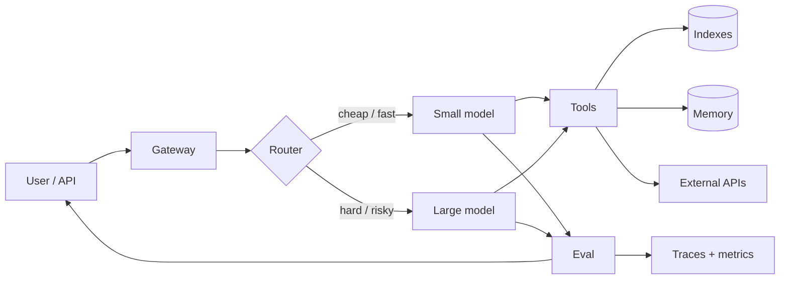

# The AI System Design Primer

Learn how to design production AI systems.
Prep for the AI system design interview.

**[Download the book PDF](book/The-AI-System-Design-Primer.pdf)** — 7×10 modern trade layout, cover, contents, parts, and all chapters.

This is a living document: architectures, numbers, and failure modes are
updated as the field moves. It is not a list of links, a framework tutorial,
or a roadmap of empty folders.

**Two jobs, one repo**

1. **Become a better engineer.** Shipping LLM features is easy. Shipping
   systems that stay correct, cheap, and safe is not.
2. **Pass the interview.** Staff-level loops now include "design a support
   agent", "design RAG over our corpus", "design an eval platform". The
   format is the old system-design interview. The failure modes are new.

| I want to… | Go here |
| --- | --- |
| Learn the mental models in one sitting | [Study paths](#study-paths) and [Ten laws](#ten-laws) |
| Design retrieval that does not silently lie | [RAG](docs/topics/04-rag.md) · [Retrieval](docs/topics/05-retrieval.md) · [Silent lies](docs/failures/01-rag-silent-lies.md) |
| Decide if I even need an agent | [Agents are loops](docs/topics/06-agents.md) |
| Stop guessing and start measuring | [Evals](docs/topics/09-evals.md) · [Eval gaming](docs/failures/03-eval-gaming.md) |
| Control cost and latency | [Cost, latency, routing](docs/topics/11-cost-latency-routing.md) |
| Not get prompt-injected | [Safety](docs/topics/12-safety.md) · [Injection](docs/failures/04-prompt-injection.md) |
| Practice interviews | [Interview index](docs/interviews/README.md) |

## Why this exists

Classical system design taught you to think in QPS, storage, and fan-out.
AI system design adds four resources the old primer never had to budget:

| Resource | What blows up | Unit you must name |
| --- | --- | --- |
| **Tokens** | Context bloat, verbose tools, retry storms | input / output / cached |
| **Attention** | Lost-in-the-middle, instruction collision | working set of the model |
| **Judgment** | Silent wrong answers that look fluent | evals, not vibes |
| **Authority** | Tools, memory, and the web can seize the helm | who is allowed to do what |

If your design does not name those four, it is a chatbot wrapper, not a system.

## Study paths

**Weekend (engineer who has shipped a prototype)**
1. [How to use this primer](docs/topics/00-how-to-use.md)
2. [The systems model of an LLM](docs/topics/01-llm-systems-model.md)
3. [The request path](docs/topics/02-request-path.md)
4. [RAG](docs/topics/04-rag.md)
5. [Agents are loops](docs/topics/06-agents.md)
6. [Evals](docs/topics/09-evals.md)
7. Interview: [Enterprise RAG](docs/interviews/03-enterprise-rag.md)

**Two weeks (interview loop)**
- All of [Topics](#topics)
- All of [Failure atlas](#failure-atlas)
- Eight interviews, spoken out loud, with a timer

**Staff / principal**
- [Memory](docs/topics/08-memory.md), [Routing](docs/topics/11-cost-latency-routing.md),
  [Safety](docs/topics/12-safety.md), [Gateways](docs/topics/13-gateways.md)
- Failures: [eval gaming](docs/failures/03-eval-gaming.md),
  [memory poisoning](docs/failures/08-memory-poisoning.md),
  [cost blowups](docs/failures/06-cost-blowups.md)
- Interviews: [gateway](docs/interviews/06-llm-gateway.md),
  [eval platform](docs/interviews/08-eval-platform.md),
  [browsing agent](docs/interviews/15-browsing-agent.md),
  [cost-optimized inference](docs/interviews/14-cost-optimized-inference.md)

## Ten laws

These are the opinions this primer will not water down. Argue with them in a
PR if you have production numbers.

1. **Evals before architecture.** If you cannot say how you will know the
   system is wrong, you are not ready to pick a vector database.
2. **The dumbest system that can be evaluated wins.** A classifier, a SQL
   query, or a 12-step DAG beats an agent until the eval says otherwise.
3. **RAG is a retrieval problem that happens to call an LLM.** Garbage
   chunks in, fluent garbage out. The model will not save you.
4. **Agents are while-loops with tools.** Draw the loop, the halt
   conditions, the budget, and the side-effect policy, or you drew a demo.
5. **Context is a scarce, dirty working set.** Every token competes.
   Retrieval, memory, and tools are admission control for attention.
6. **Output tokens dominate cost; retries dominate both cost and latency.**
   Budget them explicitly. "We'll stream it" is not a cost model.
7. **Prompt injection is SQL injection for this decade.** Untrusted text
   must not be allowed to choose tools, choose memory writes, or choose
   who to email.
8. **Memory is data engineering.** If you cannot version it, inspect it,
   tombstone it, and eval it, you built a footgun with a warm persona.
9. **LLM-as-judge will agree with itself.** Separate the judge from the
   system prompt, pin the judge model, and keep a human-labeled gold set.
10. **Write the failure in the design doc.** Silent lies, loops, cost
    spikes, and poisoned memory are not edge cases. They are the product.

## The picture you should be able to draw

Every production AI product is some cut of this:

If you are interviewing, draw this in the first five minutes, then zoom into
the box the prompt actually cares about.

## Topics

| # | Topic | You should be able to |
| --- | --- | --- |
| 0 | [How to use this primer](docs/topics/00-how-to-use.md) | Run a design the way an interviewer will |
| 1 | [The systems model of an LLM](docs/topics/01-llm-systems-model.md) | Talk about models as latency/cost/capability SLO objects |
| 2 | [The request path](docs/topics/02-request-path.md) | Trace one call from auth to billed tokens |
| 3 | [Context is a scarce resource](docs/topics/03-context.md) | Pack a prompt on purpose |
| 4 | [RAG](docs/topics/04-rag.md) | Choose naive vs agentic vs graph RAG, and say when not to |
| 5 | [Chunking, embeddings, retrieval](docs/topics/05-retrieval.md) | Design an index you can debug |
| 6 | [Agents are loops](docs/topics/06-agents.md) | Specify halt, budget, and side effects |
| 7 | [Tools and MCP](docs/topics/07-tools-mcp.md) | Design a tool surface that is hard to abuse |
| 8 | [Memory](docs/topics/08-memory.md) | Split working / episodic / profile memory |
| 9 | [Evals](docs/topics/09-evals.md) | Build an eval that predicts production |
| 10 | [Observability](docs/topics/10-observability.md) | Trace a bad answer to a span |
| 11 | [Cost, latency, routing](docs/topics/11-cost-latency-routing.md) | Hit a $ / request budget |
| 12 | [Safety](docs/topics/12-safety.md) | Threat-model tools + untrusted text |
| 13 | [Gateways, caching, structured output](docs/topics/13-gateways.md) | Build the platform layer |

## Failure atlas

Production AI fails fluently. These are the eight failures that show up in
almost every postmortem. Each page is mechanism → detection → fix → eval.

| Failure | One-line |
| --- | --- |
| [RAG silent lies](docs/failures/01-rag-silent-lies.md) | Retrieved the wrong chunk; answered anyway |
| [Agent loops](docs/failures/02-agent-loops.md) | The while-loop never earned a halt |
| [Eval gaming](docs/failures/03-eval-gaming.md) | The judge and the system share a tell |
| [Prompt injection](docs/failures/04-prompt-injection.md) | Untrusted text issued a tool call |
| [Context rot](docs/failures/05-context-rot.md) | The working set drowned the instruction |
| [Cost blowups](docs/failures/06-cost-blowups.md) | Retries, tools, and output tokens stacked |
| [Tool hallucination](docs/failures/07-tool-hallucination.md) | Invented arguments, or skipped the tool |
| [Memory poisoning](docs/failures/08-memory-poisoning.md) | A lie got persisted and then trusted |

## Interviews

Work these like a whiteboard: 35–45 minutes, requirements first, numbers
second, one deep dive, failure modes last. Full solutions:

1. [Design ChatGPT](docs/interviews/01-design-chatgpt.md)
2. [Design a customer support agent](docs/interviews/02-customer-support-agent.md)
3. [Design enterprise RAG](docs/interviews/03-enterprise-rag.md)
4. [Design a coding assistant](docs/interviews/04-coding-assistant.md)
5. [Design AI search](docs/interviews/05-ai-search.md)
6. [Design an LLM gateway](docs/interviews/06-llm-gateway.md)
7. [Design memory for a personal assistant](docs/interviews/07-personal-memory.md)
8. [Design an eval platform](docs/interviews/08-eval-platform.md)
9. [Design a code review agent](docs/interviews/09-code-review-agent.md)
10. [Design a realtime voice agent](docs/interviews/10-voice-agent.md)
11. [Design multimodal product search](docs/interviews/11-multimodal-search.md)
12. [Design workplace search](docs/interviews/12-workplace-ai.md)
13. [Design LLM content moderation](docs/interviews/13-moderation.md)
14. [Design cost-optimized inference](docs/interviews/14-cost-optimized-inference.md)
15. [Design a browsing agent](docs/interviews/15-browsing-agent.md)
16. [Design an AI tutor](docs/interviews/16-ai-tutor.md)
17. [Design meeting summarization](docs/interviews/17-meeting-summarization.md)
18. [Design a multi-agent research system](docs/interviews/18-multi-agent-research.md)

How to run the interview, including what interviewers listen for:
[interviews/README.md](docs/interviews/README.md)

## Numbers in this repo

Prices, model names, and context windows go stale. We keep **ratios and
budgets** in the text and mark dollar figures as examples.

Rules of thumb that usually survive a generation:

- Output tokens cost several times input tokens.
- A retry is often more expensive than a larger first model.
- Prefix / prompt cache hits are the difference between a viable chat
  product and a finance incident.
- Embedding + rerank is cheap next to generation. Retrieval quality is
  still where most products die.
- p50 time-to-first-token is a UX number. p95 total tokens is a cost number.
  Do not mix them.

When you update a number, update the date in the chapter. See
[CONTRIBUTING.md](CONTRIBUTING.md).

## What this is not

- A catalog of 500 agent projects.
- A bet on one vendor or one agent framework.
- A replacement for [system-design-primer](https://github.com/donnemartin/system-design-primer).
  You still need queues, load balancing, and data stores. This primer is the
  layer that sits on top when the request is probabilistic.

## Contributing

PRs that add a real failure, a real number, or a complete interview are
worth more than PRs that add a heading. Please read [CONTRIBUTING.md](CONTRIBUTING.md).

## License

Prose is [CC BY-SA 4.0](LICENSE). Code samples are MIT.

---

If this primer saves you an incident or an interview, star it and send a
failure back.
