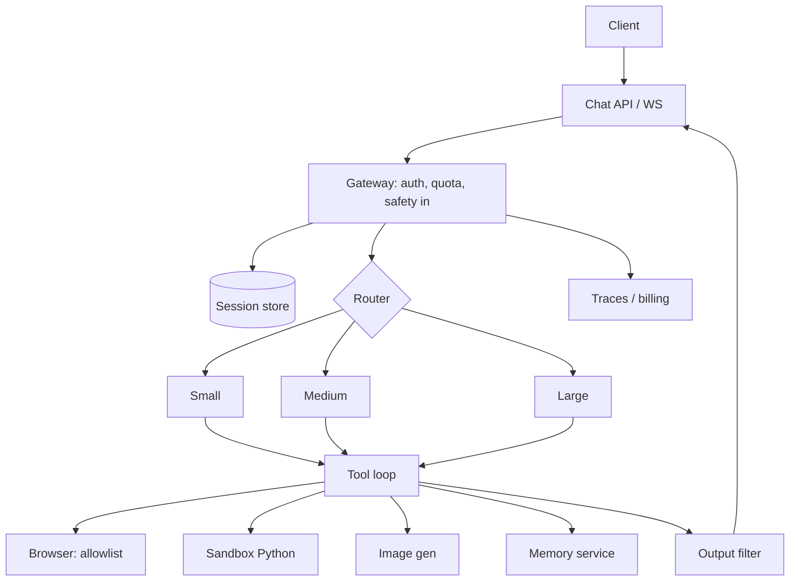

# Design ChatGPT

## Prompt

Design a ChatGPT-like consumer assistant: multi-turn chat, tools
(browse, code, images), memory, streaming, free + paid tiers.

## Clarify

Ask:

- Consumer vs enterprise (this solution: consumer, plus a paid tier)
- Must tools include *browse and code execution*? Yes
- Memory: optional, user-visible
- Wrong-answer cost: reputation, not wire transfers (still: injection)
- Latency: stream TTFT < 1s p50 on paid
- Non-goals: custom GPTs marketplace internals, ads, telephony

Trust model: the **user is not fully trusted** (jailbreak, budget
abuse). The **web is hostile**. Generated code is hostile.

## Scale (invented)

- 50M MAU, 5M DAU
- 20 messages / DAU / day → **100M messages / day ≈ 1.2k QPS average,
  4k QPS peak**
- Mix: 70% short chat (S/M model), 20% RAG-ish / browse, 10% heavy
  (code, long)

## Envelope

Assume a blended 2k tokens in, 400 out, 40% prefix-cache hit on input,
paid mix of S/M/L.

```text
100e6 msgs * (2000 * p_in * 0.6 + 2000 * p_cached * 0.4 + 400 * p_out)
```

You do not need a precise $ on the board. You need to say:

- Output tokens and browse-heavy sessions dominate
- Free tier is a **quota** product or it is a charity
- Peak QPS is a capacity problem; $ is a mix problem

TTFT: queue + prefill. Keep system+tools prefix stable for cache.
Paid SLO tighter; free degrades to smaller models and longer queues.

## Architecture



Control plane: prompt registry, model pins, feature flags per tier.
Data plane: messages, files, memory, traces.

## Deep dive 1 — session and streaming

- Messages in a durable store keyed by `thread_id`
- Working set packed per [context](../topics/03-context.md): last N
  turns + memory pointers + tool dumps capped
- Stream tokens over WS; **do not stream tool side effects**
- Client shows "searching…" from tool spans, not from model prose

## Deep dive 2 — tools

Three tools, three sandboxes:

| Tool | Sandbox | Gate |
| --- | --- | --- |
| Browse | Domain policy, no private IPs, size cap | Read-only |
| Python | No net, time/mem cgroup, no secrets in env | Read-only toward user files |
| Image | Quota | Content policy |

The browse **result is quarantined**. The model may cite; it may not
take a send-email tool you should not have given this product anyway.

Code execution returns stdout truncated. Never `eval` model text on
your API hosts.

## Deep dive 3 — tiers and routing

- Free: S by default, M on difficulty, hard caps on browse/python,
  aggressive cache, longer TTFT OK
- Paid: M default, L on hard, higher budgets
- Router features: message length, whether tools are enabled, user
  risk score, remaining quota
- Escalate once

## Failures

- [Injection](../failures/04-prompt-injection.md) via browse
- [Loops](../failures/02-agent-loops.md) in tool use
- [Cost](../failures/06-cost-blowups.md) on free tier
- [Memory poison](../failures/08-memory-poisoning.md) if you persist
  inferred "personality"

## Evals

- Instruction following gold set (schema, refusal)
- Browse: citation exists on the fetched page
- Python: hidden tests, not the model's "all tests passed"
- Safety: injection set, self-harm policy (product-specific)
- Online: TTFT, $ / thread, report rate

## Listen for

Quotas, prefix cache, quarantined browse, sandbox, router, memory as
a service not a blob.

## Cut list

Ship chat + streaming + quotas first. Then python sandbox. Then
browse. Memory last, with a UI.
