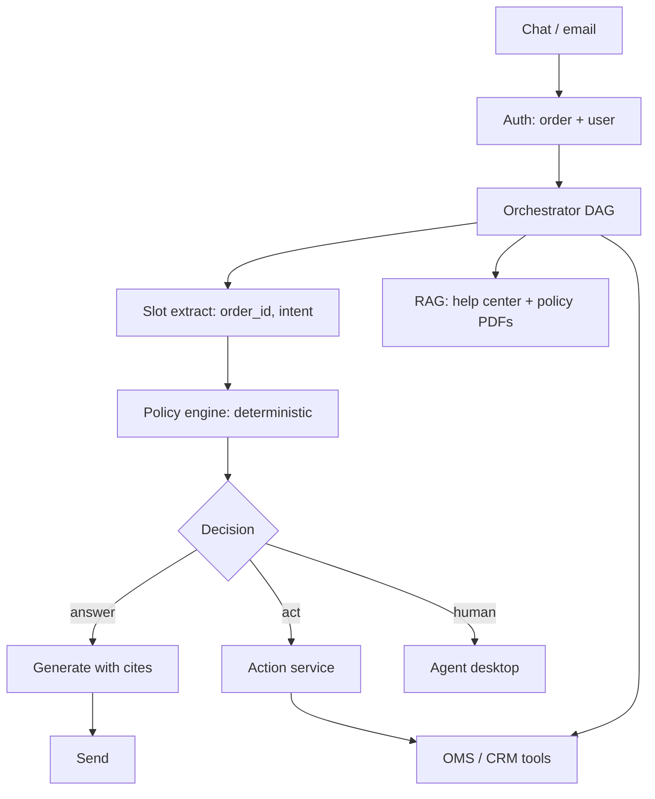

# Design a customer support agent

## Prompt

Design an AI support agent for an e-commerce company. It should answer
order questions, apply refunds under policy, and escalate.

## Clarify

- Channels: chat + email (same brain, different IO)
- Languages: start with one, architecture should not block more
- Write actions: refund, cancel, address change — **policy-bound**
- Wrong-answer cost: **high** (money, legal, CX)
- Latency: chat TTFT < 1s; email batch OK
- Non-goals: phone voice (see [voice](10-voice-agent.md)), open-ended
  life advice

Trust: user is who they authenticated as. Ticket text and attachments
are **untrusted** (injection from scammers). Policies are trusted
after ingest.

## Scale (invented)

- 2M orders / month
- 10% contact rate → 200k tickets / month ≈ 0.08 QPS average, **5–20
  QPS** peaks after incidents
- This is **not** a QPS interview. It is a correctness interview.

## Envelope

Most cost is not the LLM. It is **wrong refunds** and **handle time**.
Still show $:

- 200k tickets * 3 model calls * (1.5k in, 200 out) — small
- Tool calls to OMS/CRM dominate latency (200–800ms each)

Optimize **policy precision**, not tokens.

## Architecture



**This is a DAG with an LLM in slots, not an unbounded agent.** Promote
the remaining 10% of tickets to a budgeted loop.

## Deep dive 1 — policy vs prose

Refund eligibility is **code**:

```text
if order.status in shipped_received
and now - delivered_at <= 30d
and reason in {damaged, never_arrived}
and amount <= 100
and not already_refunded:
    allow
```

The model extracts `reason` and `amount`. The engine decides. The
model **explains**. If you let the model decide, you will refund
poetry.

Keep a `policy_version` on every action. When legal changes the PDF,
you change the engine **and** re-ingest RAG. RAG is for explanations
and FAQs, not for the money path.

## Deep dive 2 — tools

```text
get_order(order_id)           # authz: must belong to user
list_shipments(order_id)
issue_refund(order_id, amount, policy_id, idempotency_key)
cancel(order_id, ...)
transfer_to_human(ticket_id, summary)
```

No `run_sql`. No `http`. Idempotency keys = `ticket_id + step`.
Irreversible tools only callable from the action service after the
engine says allow.

## Deep dive 3 — RAG

Help center + policy + past **public** macros. Hybrid search + rerank.
Cite-or-refuse. ACL: no other customers' tickets in the index the
model sees. (Internal agents may have a separate, audited index.)

## Failures

- Silent lies on policy ([RAG](../failures/01-rag-silent-lies.md))
- Injection in ticket attachments
  ([injection](../failures/04-prompt-injection.md))
- Tool hallucination: "I refunded you"
  ([tools](../failures/07-tool-hallucination.md))
- Memory of a prior (wrong) refund
  ([poison](../failures/08-memory-poisoning.md))

## Evals

Gold tickets: labeled `(intent, action or none, citations)`.
**Action exact-match** is the metric that matters. Unanswerable and
hostile tickets included. Online: reopen rate, refund reversal rate,
escalation rate, CSAT.

## Listen for

Deterministic policy, idempotency, DAG not agent, cite-or-refuse,
authz on `get_order`.

## Cut list

Ship: auth + get_order + RAG answers + human escalate.
Then cancel. Then refund under the tightest rule. Never start with a
free-form agent that "just has CRM access".
