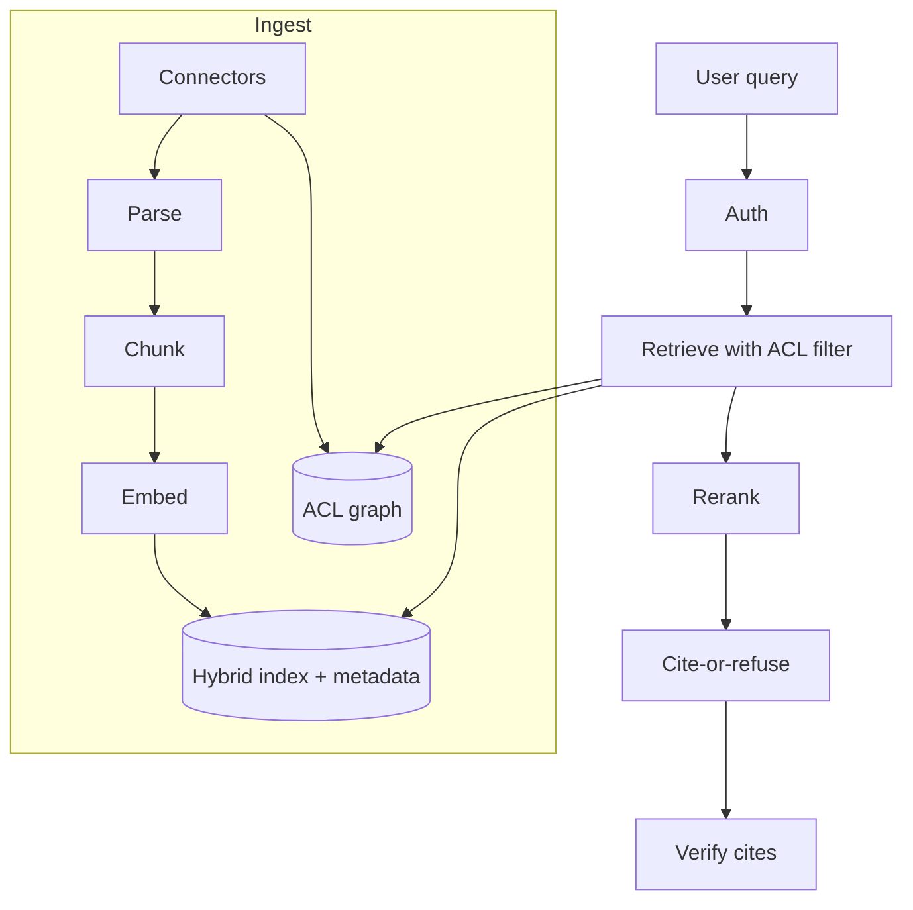

# Design enterprise RAG

## Prompt

Design a "chat with your company docs" product for a 20k-person
company: wikis, PDFs, tickets, code, with permissions.

## Clarify

- Corpus: Confluence, Drive, PDFs, GitHub, Slack — **yes to ACLs**
- Wrong-answer cost: high (legal, HR, security)
- Freshness: wiki minutes-to-hours; HR policies immediately after
  publish
- Latency: 3–5s complete OK; stream
- Non-goals: training a company model from the corpus

## Scale (invented)

- 20k employees, 2k DAU, 10 queries/day → ~0.2 QPS avg, easy
- Corpus: 50M chunks after split — **this is an index + ACL interview**

## Envelope

QPS is cheap. **Ingest and permissions** are the system.
$ is dominated by generation if you stuff 40 chunks. Keep n=5 after
rerank.

## Architecture



## Deep dive 1 — ingest

Connectors emit `document_id, bytes, acl_version, modified_at`.
Pipeline is idempotent on content hash.

- Parse per type (Markdown AST, PDF layout, code symbols)
- Chunk with titles prepended ([retrieval](../topics/05-retrieval.md))
- `index_generation` monotonically increases
- Deletes / ACL revokes: tombstone in metadata **and** the ACL graph
  within the freshness SLO (HR: minutes)

Slack and tickets: default **off** for the general index. They are
injection-heavy and permission-nightmare. Enable per-workspace with
tighter ACLs.

## Deep dive 2 — ACLs

Do not retrieve then filter in Python if you can avoid it (TOCTOU +
leaks via scores). Push down:

```text
WHERE tenant = acme
  AND (acl_public OR acl_id IN :user_groups)
  AND not tombstoned
```

User groups from the identity provider, cached with a short TTL,
revoked on logout. **Never** put "you are Alice from HR" in the prompt
as the only control.

Shared embeddings across tenants are a non-goal here (single company)
but **HR vs engineering** is still a tenant-like partition. Consider
separate indexes for highly sensitive sources (comp, legal).

## Deep dive 3 — query path

1. Query rewrite (small model) for acronyms
2. Hybrid retrieve 50
3. Rerank 5
4. Generate with chunk ids
5. Verifier; else refuse

Empty retrieval → "I don't see this in sources you can access." That
sentence is a feature (ACL) not a bug.

## Failures

- Silent lies
- ACL leaks (the actual firing offense)
- Stale policy after a handbook update
- Injection via a public Confluence page an attacker can edit

## Evals

Permissioned gold: user A must not retrieve doc B.
Recall@k on labeled pairs.
Unanswerable + stale-doc pairs.
Online: report button, "wrong project" rate.

## Listen for

ACL in the retriever, index generation, hybrid+rerank, refuse path,
connectors as a product.

## Cut list

Ship wiki + Drive with ACLs and cite-or-refuse. Code later. Slack last
or never.
