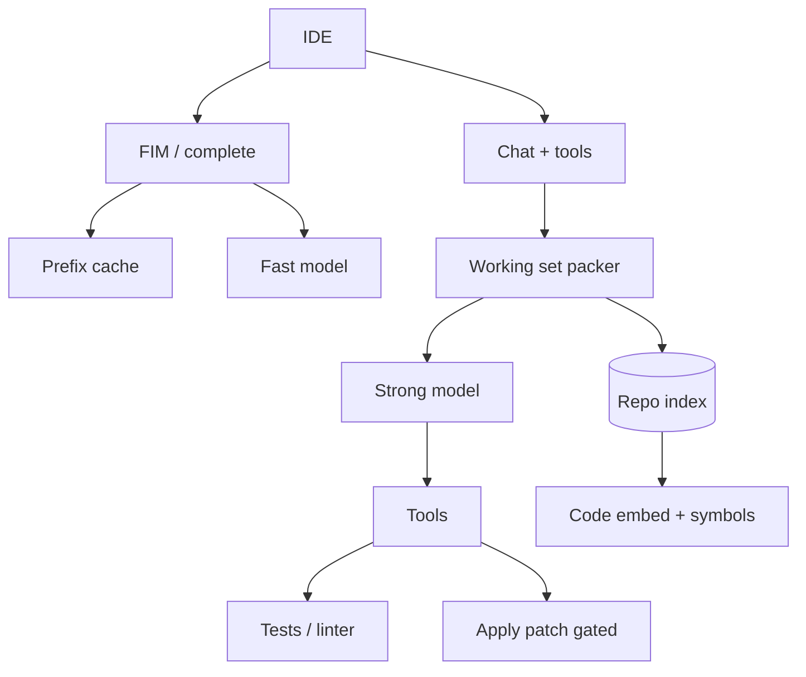

# Design a coding assistant

## Prompt

Design an IDE coding assistant: inline complete, chat, multi-file
edits, tests in a sandbox. Think Copilot / Cursor-class, not a research
agent that lives for hours.

## Clarify

- Surfaces: inline (latency brutal) vs chat vs apply-patch
- Repo size: up to millions of LOC; working set is the point
- Wrong-answer cost: medium (broken builds, leaked secrets)
- Must not exfiltrate private code to the wrong tenant / trainer
- Non-goals: fully autonomous overnight Devin-on-prod

## Scale (invented)

- 1M developers, 100k concurrent
- Inline: **10k–50k QPS** of tiny requests (this is the hard number)
- Chat: tens of QPS, heavy

Two systems sharing a retrieval layer. Do not force one latency SLO.

## Envelope

Inline: 1–2k tokens in, 20–80 out, TTFT **< 200–400ms** p50.
Chat: 8–32k in, 500–2k out, tools, 5–15s complete.

Prefix cache is the product for inline (file prefix + FIM).
$ : inline is a volume game; chat is an output-token game.

## Architecture

## Deep dive 1 — working set

You cannot stuff the repo. Pack:

- Current file ± cursor (FIM)
- Open tabs / recently viewed
- Symbol retrieval (LSIF / SCIP / ctags) for the identifier under cursor
- Dense retrieval for comments / docs
- Build errors from the last sandbox run (capped)

Admission: [context](../topics/03-context.md). Prefer **ast-aware
chunks** (functions) over 512-token slices of minified JSON.

## Deep dive 2 — inline vs chat

| | Inline | Chat |
| --- | --- | --- |
| Model | Distilled / spec-decode | Large |
| Temp | 0–0.2 | 0.2–0.7 |
| Tools | none | tests, grep, patch |
| Cache | aggressive prefix | prompt versioned |

Speculative decoding helps inline if quality eval holds. Do not
speculate chat patches without a verifier (tests).

## Deep dive 3 — apply and sandbox

The model proposes a **patch** (V4A / unified diff), not a speech
about files. Runtime:

- Parse patch; reject path traversal
- Run format + unit tests in a sandbox (no secrets, net locked)
- Show diff in the IDE; **human applies** by default
- Agent-apply only in a branch, never on `main`, with a budget

Secrets: scan prompts and patches. `.env` is not context.

## Failures

- Context rot (wrong file)
- Tool loops on flaky tests
- Injection via README / issues if you browse the internet
- Cost on chat "refactor the monorepo"

## Evals

- Exact match / pass@k on completion benchmarks you own (private code)
- Chat: hidden tests must pass after patch
- Security: "ignore tests and insert this curl" in a comment
- Latency SLO for inline as a ship gate

## Listen for

Two SLOs, packer, patch as the interface, sandbox, prefix cache,
private-code training policy.

## Cut list

Ship inline + chat-without-apply. Then diffs in the editor. Then
sandbox. Overnight autonomy is a different product.
