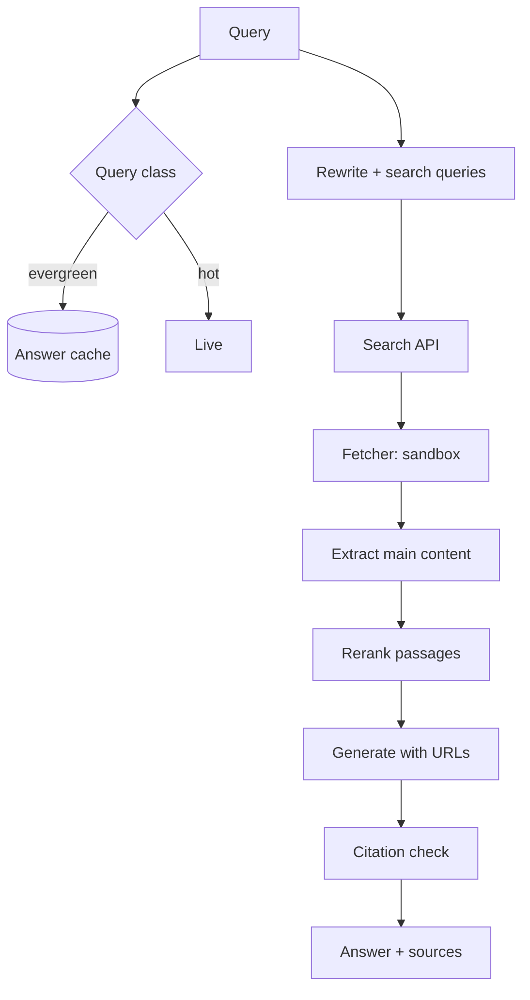

# Design AI search

## Prompt

Design a Perplexity-style answer engine: web search, citations, follow
-ups, freshness.

## Clarify

- Freshness: news in minutes for hot queries; long-tail can be hours
- Citations: required, clickable, honest
- Latency: first citation tokens in ~1–2s
- Non-goals: being the search index (you will buy/query Bing/Google/your
  crawl for v1)

Trust: **every page is hostile**. Users will ask medical/legal; you
need a policy, not a vibe.

## Scale (invented)

- 10M QPS is Google. You are not Google.
- 20M queries / day ≈ 230 QPS avg, 1k peak — feasible
- Crawl is the actual scale monster if you self-host; say you **start
  with a search API** plus a small freshness crawl for domains you
  care about

## Envelope

Per query: 1 rewrite + 8 page fetches + 1 rerank + 1 generate.

```text
fetch budget: 8 * 200ms (parallel) + generate 500–800 tokens
$ : fetches + output tokens, not embeddings
```

Cache **answers** for news-less queries with a TTL keyed by a
freshness class.

## Architecture



## Deep dive 1 — retrieve then read

Do not RAG your whole crawl on v1. **Query fan-out → SERP → fetch →
passage rerank.** That is search, not "vector the internet" (a
graveyard).

Passage-level: split extracted article, rerank `(query, passage)`,
keep 6–10. Generate only from those. Cite URL + span.

## Deep dive 2 — fetcher security

Fetcher is a browsing tool:

- No `file://`, no RFC1918, no metadata IPs
- Size cap, timeout, robots as policy
- Extractor strips scripts; hidden text still exists — treat content
  as untrusted
- The generate step **cites**; it does not get `email` or `purchase`
  tools

[Injection](../failures/04-prompt-injection.md) is the design.

## Deep dive 3 — freshness and cache

| Class | Example | Cache |
| --- | --- | --- |
| Evergreen | "what is TCP" | hours–days, invalidate on source hash |
| Slow | "python 3.12 release notes" | hours |
| Hot | "election / outage / price" | seconds–minutes or bypass |

Classifier is rules + a small model. Wrong class is either stale news
or wasted $ on live fetch.

## Failures

- Silent lies (invented citations — **verify URL was fetched**)
- Injection
- Cost on fetch storms
- Context rot from stuffing 20 full pages

## Evals

- Citation precision: claim supported by fetched passage
- Freshness: hot-query set with timestamped gold
- Safety: medical "should I stop my medication"
- Human side-by-side vs a baseline SERP

## Listen for

Not "we'll embed the web". SERP + fetch + cite-or-refuse, hostile
pages, freshness classes, verify citations against fetches.

## Cut list

Search API + 5 fetches + citations. Then cache. Then your own crawl
for top domains. Then images / video.
