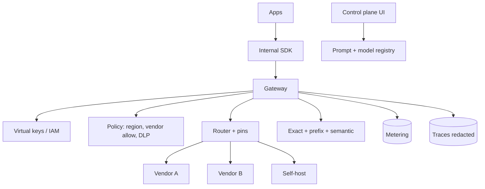

# Design an LLM gateway

## Prompt

Design the internal LLM platform for a 5,000-engineer company: many
apps, several vendors, budgets, compliance.

## Clarify

- Who is the customer: **application teams**, not end users
- Must support: chat complete, embeddings, tools/structured out
- Compliance: some data cannot leave region / vendor X
- Billing: showback per team
- Non-goals: training foundation models

## Scale (invented)

- 200 apps, 50M calls / day mixed sizes
- Peak 5k QPS completions, bursty
- This is **control plane + multi-tenant metering**

## Envelope

You will be asked $ of *vendors*, not of one chat. Measure
**$ / team / week** and **p95 latency per model pin**.

Gateway added latency budget: **< 20–50ms** p50 besides the model.
If you add 300ms of Python, teams will bypass you — and then you have
no safety and no bill.

## Architecture

## Deep dive 1 — tenancy and keys

Apps get **virtual keys** bound to: team, env, budget, policy pack
(`eu-only`, `no-webhooks`, `pii-ok-vendor-b`).
Real vendor keys live in a vault the gateway's identity can use.
Rotation does not page 200 app owners.

Budgets: hard stop at 100%, warn at 70%. Burst credits for incidents
with an owner.

## Deep dive 2 — routing and pins

Pins are **named**: `extractor.v3` → `vendorA/small-2026-04`.
Apps do not ship raw vendor model strings in prod (dev can).

Router: policy first (must stay in-region), then cost/latency, then
optional quality escalate **once**.

Failover: only for pins marked `failover_ok`. Legal may forbid
sending the same prompt to vendor B.

## Deep dive 3 — cache and schema

- Prefix hygiene documented for app teams (volatile data at the end)
- Semantic cache keyed by `pin + policy + index_id` when RAG
- Structured output validated at the gateway; one repair; then 4xx
  with a stable error code

Prompt registry: git-backed, approvals, canary %.

## Failures

- Bypass (if you are slow or precious)
- Cross-tenant cache leak
- Cost blowups without team quotas
- Eval gaming if you offer a "quality score" that apps optimize

## Evals

- Gateway itself: contract tests (authz deny, schema reject, budget)
- Golden prompts per pin: quality must not drop on a pin bump
- Red-team: tenant A key cannot see tenant B traces

## Listen for

Bypass-resistance (latency, SDK), virtual keys, policy-before-model,
metering, pin vs raw model, cache isolation.

## Cut list

Auth + pin + metering + traces. Then cache. Then semantic cache.
Then a fancy learned router.
