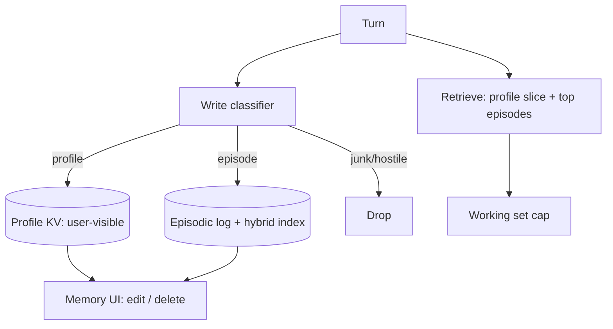

# Design memory for a personal assistant

## Prompt

Design long-term memory for a consumer personal assistant (chat +
email + calendar). It should remember facts and preferences across
months, without becoming creepy or wrong.

## Clarify

- Surfaces: chat, email drafts, calendar
- User-visible memory editor: **yes** (non-negotiable)
- Wrong-answer cost: privacy incidents + wrong life facts
- Multi-user household: maybe later; design tenancy now
- Non-goals: training a custom user model

Trust: user messages are semi-trusted. Email bodies and web tools are
**not**. See [poisoning](../failures/08-memory-poisoning.md).

## Scale (invented)

- 10M users, 1M DAU
- Memory writes: << 1 / session if gated; retrieval every turn
- Per-user data is small (MBs). The problem is **correctness and
  isolation**, not petabytes.

## Envelope

Retrieval is a tiny RAG query. $ is negligible vs generation.
Latency: memory retrieve **< 50–100ms** p95 so it sits on the chat
path.

## Architecture

Three stores as in [memory](../topics/08-memory.md). No fourth "vibe
vector".

## Deep dive 1 — write policy

Classifier (small model + rules):

| Label | Action |
| --- | --- |
| explicit preference | profile, show in UI |
| durable fact ("I moved to Austin") | profile, confirm if high impact |
| event ("meeting with Jan Tue") | episodic, TTL |
| inferred mood | drop |
| from email/web | **not eligible for profile** |
| contradiction | ask, don't blend |

Rate limit writes. A looping agent cannot mint 400 memories.

## Deep dive 2 — retrieve

- Always inject a **small profile card** (≤ 400 tokens) for the skill
  (calendar vs chat)
- Hybrid-search episodic with `user_id` filter **in the query**
- Recency prior: last 30 days boosted
- Cite in the UI: "Saved from your message on 12 Jun"

Conflicts: surface, don't average.

## Deep dive 3 — forget and export

- Delete in UI tombstones SQL + index
- Export = JSON of profile + episodes (GDPR)
- Retention: raw email used for a write is not kept by default; store
  a pointer the mail provider already has
- Household later: `space_id` on every row from day one

## Failures

- Poison from email
- Cross-user leak (the career-ending bug)
- Context rot from dumping all memory
- Eval gaming if "persona consistency" is a vibe judge

## Evals

Pin / forget / poison / conflict tests in CI.
Human review of a sample of profile writes weekly until the classifier
is boring.

## Listen for

Three stores, write gates, user-visible profile, tenant filter in
retriever, no inferred mood.

## Cut list

Ship profile KV + UI. Then episodic search. Then email-derived
episodes (still not profile). Never start with "embed everything".
