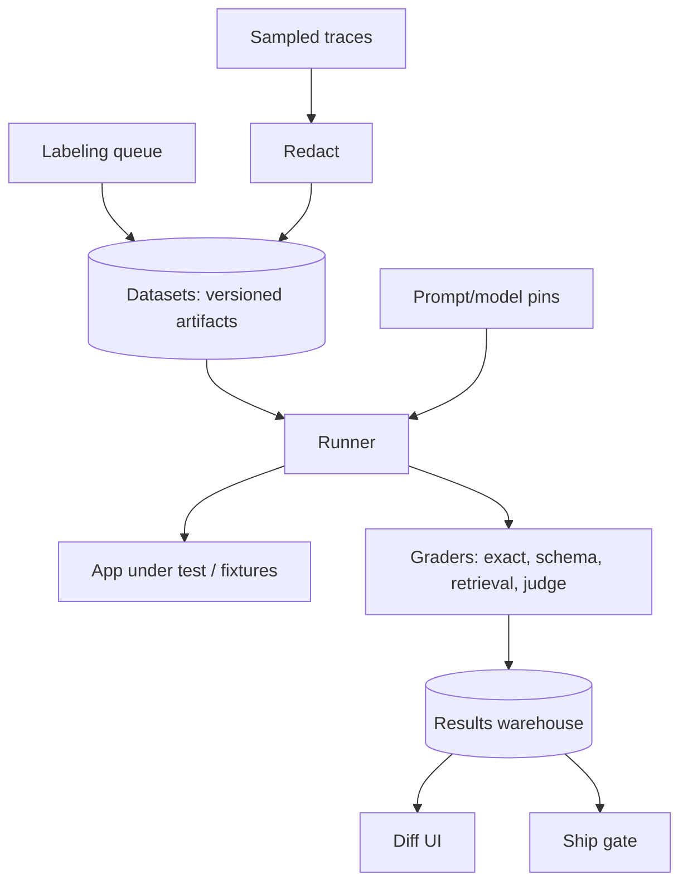

# Design an eval platform

## Prompt

Design the eval platform every AI app in the company will use: offline
suites, judges, canaries, comparison of prompts/models.

## Clarify

- Customers: app teams + a central AI platform group
- Must attach to the [gateway](06-llm-gateway.md)
- Human labeling: yes
- Online evals: sample production traces (privacy!)
- Non-goals: replacing unit tests for ordinary services

Wrong-answer cost: if the platform is gameable, the company ships
lies with green dashboards. See [eval gaming](../failures/03-eval-gaming.md).

## Scale (invented)

- 200 apps, 2k suites, 50M graded examples / day is **not** the start
- Start: 1M examples / day, bursty CI
- Hard part: **dataset versioning + judge calibration**, not QPS

## Envelope

Judges are L-model calls. Cost can exceed the product. Budget per
suite. Cache temperature-0 judgments on `(judge_pin, example_hash)`.

## Architecture



## Deep dive 1 — dataset as artifact

A dataset is a content-addressed bundle:

```text
dataset@sha
  examples.parquet
  fixtures/   # corpora generations, tool stubs
  spec.yaml   # metrics, splits, permissions
```

Live indexes are forbidden for ship gates. You can have a separate
**drift job** that runs against prod retrieval, clearly labeled
non-blocking.

Splits: train (few-shot), dev (iterate), test (canary). Test ACLs:
product engineers cannot download test labels for some suites.

## Deep dive 2 — graders

Library, not one LLM:

- Exact / regex / JSON schema
- Code: run tests
- Retrieval: gold chunk in top-k
- Safety: attack success
- Judge: pinned, evidence-supplied, atomic claims
- Human: sampled, κ vs judge

A suite declares a **primary metric** that is not a 1–5. Helpfulness
is secondary.

## Deep dive 3 — CI and canary

`pin` changes open a PR. Platform runs required suites. Ship if:

- Canary not down > ε
- Cost not up > δ unless waived
- Safety not down at all

Online: sample 1% traces, redact, grade asynchronously, alert on
slices (tenant, language, injected).

## Failures

- Gaming
- PII in traces used as eval
- Flaky suites (live web)
- Platform latency so bad teams screenshot ChatGPT

## Evals of the platform

Incident replay: last quarter's production bugs must fail a suite.
If they wouldn't, the platform is decoration.

## Listen for

Versioned datasets, frozen fixtures, graders before judges, canary
permissions, cost as a metric, anti-gaming.

## Cut list

Ship dataset registry + exact graders + CI. Then retrieval metrics.
Then judges. Then online sampling.
