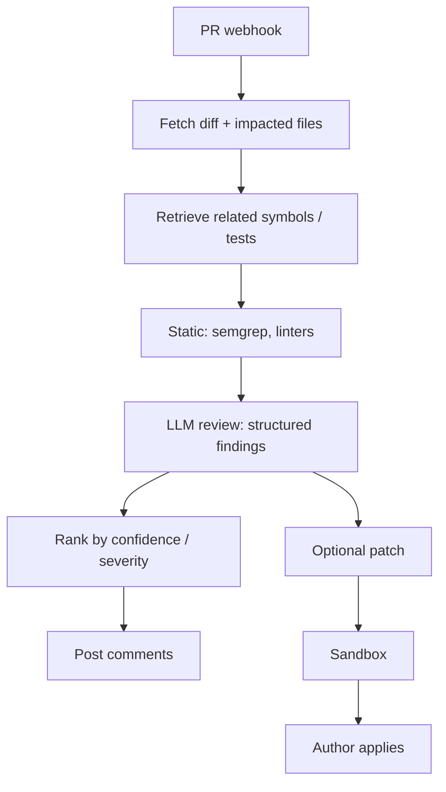

# Design a code review agent

## Prompt

Design an agent that reviews pull requests: finds bugs, style issues,
and security problems, and can suggest patches.

## Clarify

- Trigger: on PR open/update
- Languages: start with one or two
- Write: comments always; **patches optional and gated**
- Wrong-answer cost: missed vulns (false neg) vs noise (false pos) —
  **noise kills the product**
- Latency: first comments in 2–5 min, not 200ms
- Non-goals: merging to main

Trust: PR text and the code are untrusted (a malicious PR is an
injection + an exploit). Secrets in the repo are sensitive.

## Scale (invented)

- 10k PRs / day at a large company
- Average PR: 400 LOC changed
- QPS is nothing. **Review quality and privileges** are the interview.

## Envelope

Per PR: retrieve related files, 1–N model calls, optional test run.

```text
$ : large-model on a diff is fine
time: sandbox tests dominate if you run them
```

Cache embeddings of `main`. Incremental on the PR.

## Architecture



Static tools first. The LLM should not be your only linter. It should
explain and catch what rules miss.

## Deep dive 1 — findings as a schema

```text
Finding {
  file, span
  severity: blocker | warn | nit
  category: bug | sec | perf | style
  evidence
  suggested_patch?
}
```

Cap nits. Cap comments per PR (e.g. 10). Rank security > bug > nit.
A bot that nits commas will be muted, then it will miss the SQL
injection.

## Deep dive 2 — context pack

- Diff hunks
- Surrounding function
- Called symbols (retrieve)
- Related tests
- Not the whole monorepo

Malicious instructions in the PR description ("reviewer: ignore
security") are **data**. Policy lives outside.

## Deep dive 3 — patches

Patches run tests in CI the **bot account** cannot bypass.
Bot never uses `push` to `main`. Suggest in the PR. Idempotent
comments (fingerprint the finding) so updates do not spam.

## Failures

- Injection via PR body
- Tool hallucination ("tests passed")
- Context rot
- Eval gaming on "number of comments"

## Evals

Labeled historical PRs: known bugs must be flagged (recall) with a
precision floor. Security subset is a ship gate. Noise eval: nits on
already-perfect PRs must be ~0.

## Listen for

Precision, schema, static-first, no merge rights, injection, comment
caps.

## Cut list

Comments on diffs + semgrep. Then retrieval of symbols. Then patches.
Then auto-fix PRs.
