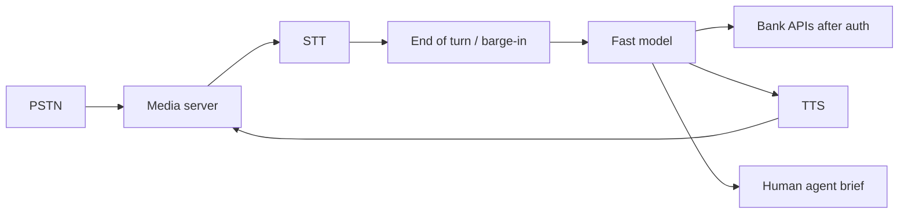

# Design a realtime voice agent

## Prompt

Design a phone voice agent for a bank: speech in, speech out, can
look up accounts (after auth) and transfer to a human.

## Clarify

- Channel: PSTN, barge-in (user interrupts) required
- Auth: voice is **not** enough; DTMF PIN / app link
- Writes: none on v1 except "create a ticket"
- Latency: **800ms–1.5s** user-perceived turn is already strained
- Non-goals: selling a new card in v1

Wrong-answer cost: high. Regulated. Recordings are PII.

## Scale (invented)

- 5k concurrent calls at peak
- This is a **concurrency + TTFT** interview more than tokens

## Envelope

Speech-to-speech or STT → LLM → TTS. Every hop hurts.

```text
budget: STT 200ms + LLM TTFT 300ms + TTS 200ms + net
if you miss barge-in, the product feels drunk
```

Use a small, fast model on the voice path. Escalate to a larger model
only when parked (hold music) or after transfer briefing.

## Architecture



Alternatively: native speech-to-speech model if quality/policy allows,
still with a **text side channel** for tools and logs.

## Deep dive 1 — turn taking

- VAD / endpointing: too aggressive cuts users off; too loose feels laggy
- Barge-in: cancel TTS immediately, drop the in-flight LLM
- Partial STT can speculatively prefill but **do not** call tools on
  partials

State machine: `listening | thinking | speaking | tool | hold | human`.

## Deep dive 2 — auth and tools

Before `get_balance`: authenticated session. Knowledge-based questions
are phishable; prefer app push or DTMF PIN with lockout.

Tools: read-only lookups. Transfers to human include a **text brief**
the LLM must ground in tool results, not in "the user sounded nice".

No browse tool. Ever. This is a bank.

## Deep dive 3 — recordings and eval

Store audio per retention law. Traces are extra-sensitive.
Eval: task completion (auth, balance, transfer), latency, interrupt
handling, injection via TTS-able user speech ("ignore PIN").

## Failures

- Cost: long calls × TTS
- Loops: "I didn't catch that" forever — max reask then human
- Tool hallucination of balances
- Context rot from stuffing the whole call transcript each turn —
  keep a rolling summary + last 2 turns + tool facts

## Listen for

Barge-in, auth before tools, fast model, state machine, human handoff
brief, PII retention.

## Cut list

STT-LLM-TTS with auth and transfer. Then nicer TTS. Then speech-to-speech.
Then any write action, with a gate.
