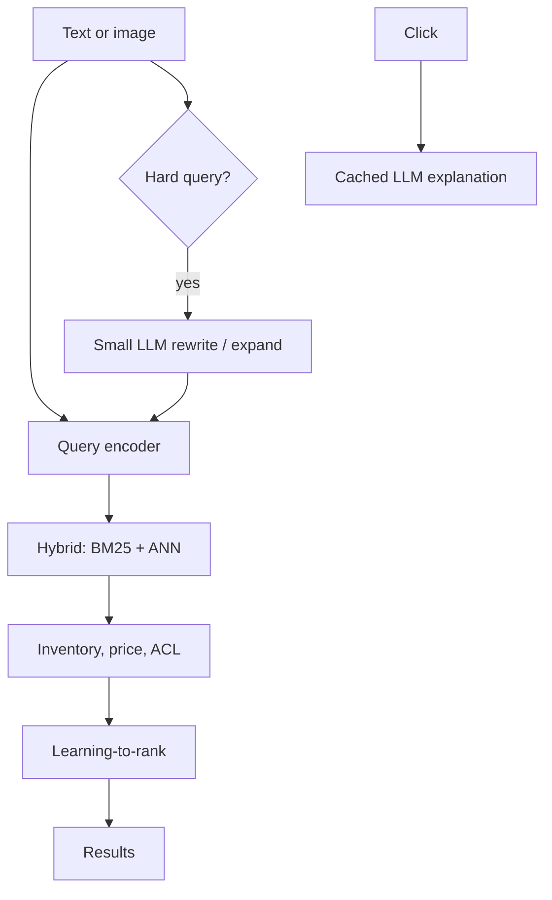

# Design multimodal product search

## Prompt

Design search for a marketplace: text query, image query ("shop this
look"), optional LLM rewrites and explanations.

## Clarify

- Catalog: 100M SKUs, images + titles + attributes
- Latency: **< 200–400ms** p50 for the result list (the product)
- LLM explanations: optional, async or on click
- Wrong-answer cost: missed GMV, not legal
- Non-goals: generating new product photos as the search index

## Scale

100M items, 10k QPS search. This is a **classical search + embeddings**
interview with an LLM sidecar. Do not put the L-model on the 10k QPS
path.

## Envelope

```text
retrieval: ANN + inverted index, 10k QPS — serious engineering
LLM rewrite: maybe 5–10% of queries, or only when recall is poor
LLM explain: on PDP / "why this", cached
```

$ : embeddings (batch, offline) dwarf nothing; **online LLM is the
bill** if you naively rewrite every query.

## Architecture



## Deep dive 1 — representations

- Text: title + attributes + OCR
- Image: catalog photos embedded offline with a vision encoder
- Query image: same encoder (must match)
- Do not mix embedding versions in one index

Shop-the-look: image ANN → same-category filter → LTR.

## Deep dive 2 — where the LLM belongs

| Job | On the 10k QPS path? |
| --- | --- |
| Typo / fashion slang rewrite | Small model, sampled or when 0 hits |
| Attribute extract from messy query | Small, cached |
| Ranking | No — LTR on clicks |
| "Why we showed this" | Off path, cached per (query, sku) |

If you generate the whole result page with an LLM you will miss SLO
and $ and you will still need retrieval.

## Deep dive 3 — eval

Search eval: nDCG, recall against human judgments and against
purchases. LLM rewrite eval: **does nDCG go up**, not "the rewrite
looks nicer". Image eval: category accuracy + retrieval recall.

## Failures

- Silent lies in explanations ("organic cotton" when it isn't) —
  explanations must use **catalog attributes**, cite-or-refuse
- Cost blowups from rewriting every query
- Embedding version skew after a model upgrade

## Listen for

LLM off the hot path, hybrid retrieval, LTR, explanation grounded in
attributes, embedding pin.

## Cut list

Ship text hybrid search. Then image ANN. Then rewrite on zero-hit.
Then explanations.
