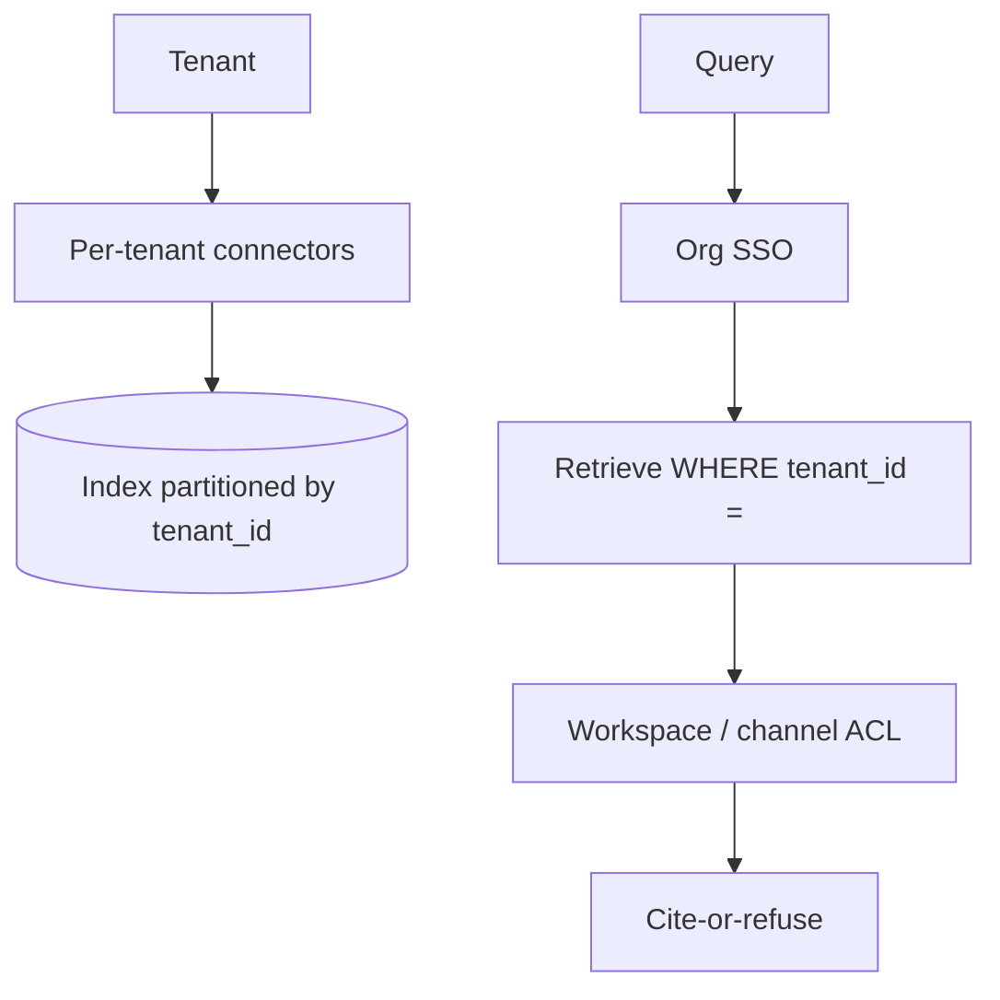

# Design workplace search / Slack AI

## Prompt

Design "ask your company's Slack + Drive + GitHub" for a SaaS product
sold to other companies (multi-tenant).

## Clarify

- Tenants: thousands of customer orgs
- Sources: Slack, Drive, GitHub, tickets
- Wrong-answer cost: **cross-tenant leak is company death**
- Latency: 5s OK
- Non-goals: training on customer data

This is [enterprise RAG](03-enterprise-rag.md) plus **hard multi-tenancy**
plus **hostile chat logs**.

## Scale (invented)

- 5k tenants, 50k DAU, low QPS
- Corpus: huge and messy
- Peak: Monday morning, still not Google-scale

## Envelope

Same as enterprise RAG. Budget $ per tenant. Isolation costs more
than ANN cleverness.

## Architecture

## Deep dive 1 — isolation

Defense in depth:

- Separate encryption keys per tenant if the product promises it
- `tenant_id` on every row, every cache key, every trace
- Physical index partition at least by tenant (or tenant shards)
- Prefix cache keyed by tenant
- No shared "hot chunks" across tenants even if text matches

A bug in a filter is a CVE. Write the retrieval test that fails if
`tenant_id` is omitted.

## Deep dive 2 — Slack is a sewer

- Default index: public channels the user can read, not DMs
- DMs: explicit opt-in, separate store
- Injection: "ignore previous instructions" is a normal joke in Slack
- Threads: chunk by thread, prepend channel + date

Cite permalinks. Users will catch lies if they can click.

## Deep dive 3 — product packaging

Per-tenant: connectors, index generation, retention, data residency,
disable-Slack-toggle. The LLM pin may be region-locked via the
[gateway](06-llm-gateway.md).

## Failures

- Cross-tenant retrieval
- Injection
- Silent lies
- Cost: some tenants dump 10 years of Slack — cap ingest, sample

## Evals

Cross-tenant probes in CI (empty by construction).
Permissioned gold per fixture tenant.
Poisoned channel messages must not cause tool calls (this product
should have **no write tools** in v1).

## Listen for

tenant_id everywhere, Slack hostility, no write tools, residency,
ACL + tenant (both).

## Cut list

Drive + wiki for one region. Then GitHub. Then public Slack. DMs
almost never.
