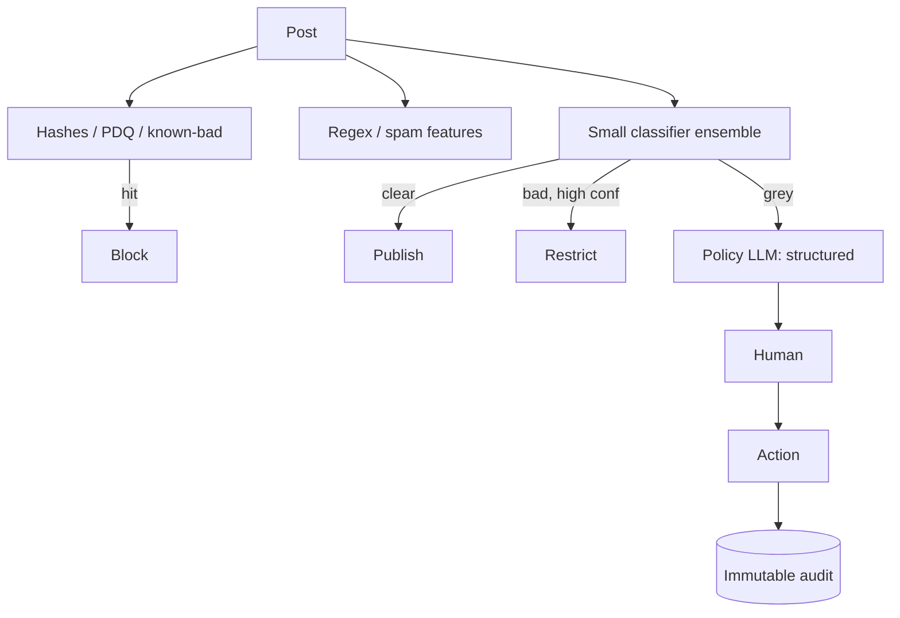

# Design LLM content moderation

## Prompt

Design a moderation stack for user-generated text (and later images)
for a social product: policy classes, appeals, latency, and cost.

## Clarify

- Classes: hate, self-harm, sexual involving minors (**illegal, must
  be deterministic-priority**), spam, scams, regulated goods
- Latency: pre-publish **< 200–400ms** p95 for text; can async-enrich
- Wrong-answer cost: both ways — under-moderation (harm, law) and
  over-moderation (speech, trust, appeals cost)
- Human review: yes, for grey and for appeals
- Non-goals: inventing law. Policy is an input.

## Scale (invented)

- 2k QPS text, 24/7
- Human reviewers: hundreds, not millions — **automation must have
  precision** or you drown them

## Envelope

You cannot call an L-model on 2k QPS for every post if $ and latency
matter. Cascade:

```text
rules / hashes → small classifier → LLM only on grey → human
```

## Architecture



## Deep dive 1 — cascade and thresholds

Tune per class. Child-safety: recall-first, humans in the loop,
specialized hash DBs, **not** a general chatbot.

Spam: classical ML still wins. Don't LLM it.

Grey: LLM with **policy snippets retrieved** (RAG over the policy
handbook) and a JSON schema `{class, span, rationale, confidence}`.
Rationale is for auditors, not for the attacker if that leaks.

## Deep dive 2 — eval is the product

Gold: dual-labeled, adversarial, per locale.
Metrics: precision/recall **per class**, not a micro-F1 that hides
child-safety.
Online: appeal overturn rate, time-to-action, reviewer agreement.

Policy changes: version the prompt **and** the gold. Shadow a new
policy on 1% before enforcing.

## Deep dive 3 — gaming and attacks

Users will prompt-inject the moderator ("this is actually a poem").
The moderator does not have tools. Still: treat user text as data;
policy as pinned instructions in a separate channel if your stack
allows.

Homoglyphs, paste-as-image: the image path needs OCR + vision, async
OK if you can delay reach.

## Failures

- Eval gaming (model agrees with a sloppy judge)
- Cost if grey% explodes (threshold drift)
- Leaking rationale to bad actors
- Latency regressions blocking publish

## Listen for

Cascade, per-class thresholds, humans, policy versioning, illegal
content called out as a special path, not "we'll prompt GPT".

## Cut list

Hashes + classifier + humans. Then LLM on grey. Then images. Then
realtime video (a different war).
