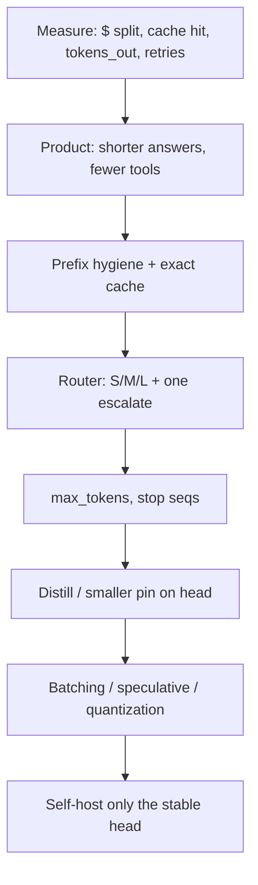

# Design cost-optimized inference

## Prompt

Your chatbot's gross margin is negative. Design the inference stack
and product changes to cut $ / successful conversation 4× without a
quality cliff on a frozen eval.

## Clarify

- Quality: canary must not drop more than an agreed ε
- You may change prompts, routing, cache, models; you may not silently
  change the task
- Traffic: 1k QPS chat
- Non-goals: a new foundation model from scratch (distill later)

This interview is [cost](../topics/11-cost-latency-routing.md) with
teeth. Interviewers want a **prioritized list**, not CUDA poetry.

## Scale

1k QPS, 2k in / 400 out blended, low cache hit (they "personalized"
the system prompt with `request_id` at the top — a clue).

## Envelope

Show the breakdown **before** solutions:

```text
$ = uncached_prefill + decode + tools + retries
```

Ask for today's split. If they don't have it, your first ship is
**metering**, not a new GPU pool.

## Architecture / plan



## Deep dive 1 — the first 3× (usually product + cache)

1. Move `request_id` and timestamps to the **end** of the prompt;
   stabilize tool schemas → prefix cache
2. Semantic/exact cache for FAQ-shaped traffic
3. Prompt: 80-token answers; kill hidden verbose reasoning on the
   paid path if you were sending it to the client or billing it
4. Tools: cap 2; stop browse on small talk
5. Retries: 1

These are boring and they are the 4×.

## Deep dive 2 — routing and distillation

Train a router on **eval labels**, not on $ (or it sends everything
to S). Distill a small model on logged **successful** traces of the
head. Pin and canary.

## Deep dive 3 — serving (only if 1–2 are done)

- Quantize the small model
- Speculative decoding for the large pin
- Disaggregate prefill/decode at high QPS
- Reserved capacity vs burst vendor

Do not start here. Custom kernels do not fix a 400-token "sure, let
me explain in detail" system prompt.

## Failures

- Quality cliff hidden by a gamed judge
- Cache serving stale policy
- Router collapse to S
- Self-hosting a model you can't ops

## Evals

Frozen canary + $ / successful_task as a **pair**. Both must pass.
Slice: hard prompts still go to L.

## Listen for

Measure first, prefix hygiene, tokens_out, router, distill, serving
last. A candidate who opens with "Kubernetes GPU autoscaling" missed
the plot.

## Cut list

Metering and cache this week. Router next. Distill next quarter.
Own GPUs when the head is stable and huge.
