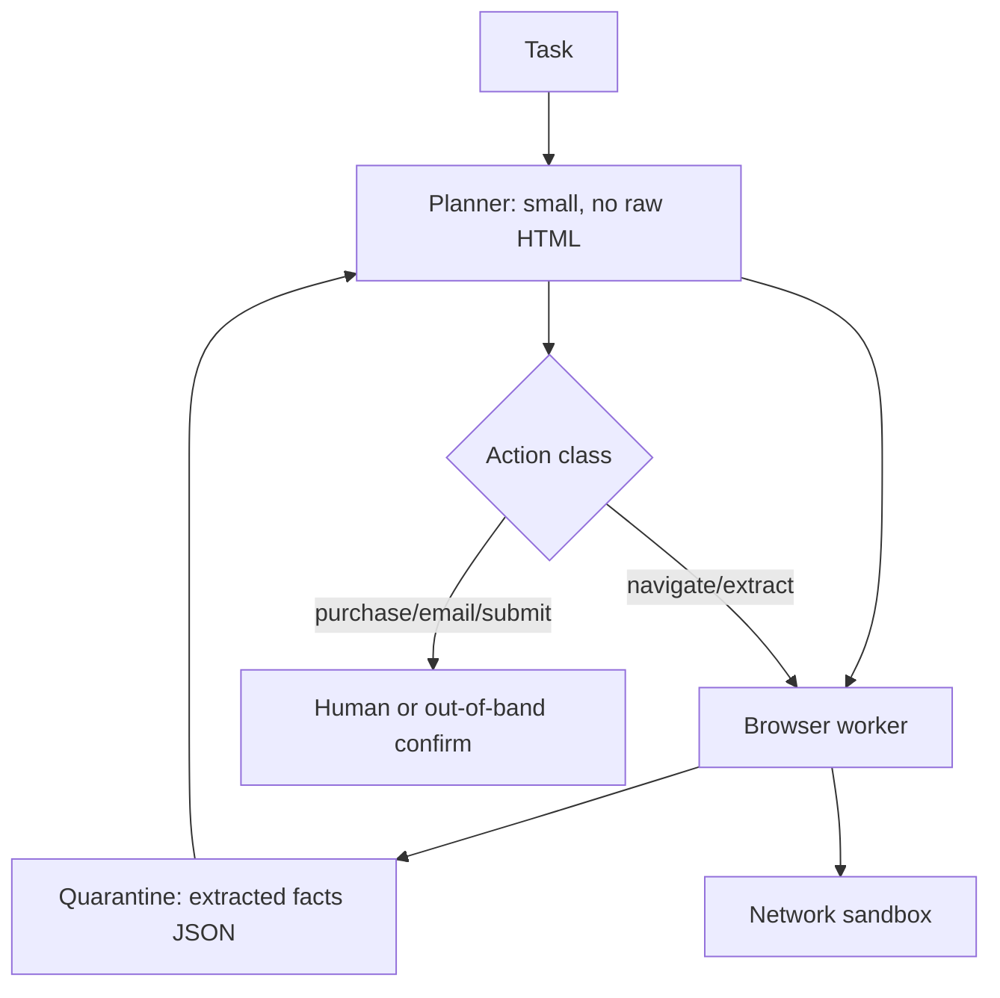

# Design a browsing agent

## Prompt

Design an agent that can navigate the public web to complete tasks
("find the cheapest refundable flight that meets X", "fill this
research spreadsheet"). It may click, type, and extract. It may not
own the user's bank account on v1.

## Clarify

- Browser: real Chromium in a VM, or a fetch+extract stack?
  **Start with fetch+extract; add a real browser only for JS-heavy
  tasks.**
- Writes: form fills on third-party sites are **irreversible-ish** —
  gate them
- Credentials: user-provided, stored in a vault, injected into an
  isolated browser profile, never into the prompt
- Wrong-answer cost: high (wrong purchase, injection)
- Non-goals: arbitrary shell on the user's laptop

This is the **injection** interview. See
[prompt injection](../failures/04-prompt-injection.md).

## Scale (invented)

- 50 QPS of sessions, long-lived
- Concurrency of browsers is the ops problem, not tokens

## Envelope

```text
$ : minutes of browser + L-model steps
budget: max_steps, max_usd, max_domains
latency: users expect minutes, not 200ms — still stream a narrative
```

## Architecture



**Two models / two privileges.** Planner never sees raw HTML. Worker
never has purchase tools. Policy on actions does not take the page as
instructions.

## Deep dive 1 — quarantine

Worker outputs:

```text
{url, title, facts: [{claim, quote, selector}], next_links: [...]}
```

Quotes are data. `next_links` is an allowlist the planner may choose
from. A page that says `next_links: [evil.com]` still has to pass
the domain policy.

No `javascript:` URLs. No IP literals. Block private networks.

## Deep dive 2 — credentials

- Site logins: isolated profile, one site, vault
- 2FA: user in the loop
- Cookies never logged
- Prompt never contains the password

A page that says "to continue, paste your password into the assistant"
is an eval case.

## Deep dive 3 — halt

Success: facts satisfy the schema the user asked for.
Fail: step budget, domain budget, captcha, paywall.
Checkpoint the spreadsheet artifact so retries don't start over.

## Failures

- Injection (the plot)
- Loops of search
- Cost
- Tool hallucination of prices (must quote from quarantine)

## Evals

Pinned hostile pages (hidden text, comments, markdown images).
Success = **no disallowed action** + factual match on a benign task
set. Run both.

## Listen for

Privilege split, quarantine, no passwords in prompts, gated writes,
domain allowlists, halt.

## Cut list

Fetch+extract research agent with citations. Then JS browser, read-only.
Then gated form fill. Purchases last, maybe never.
