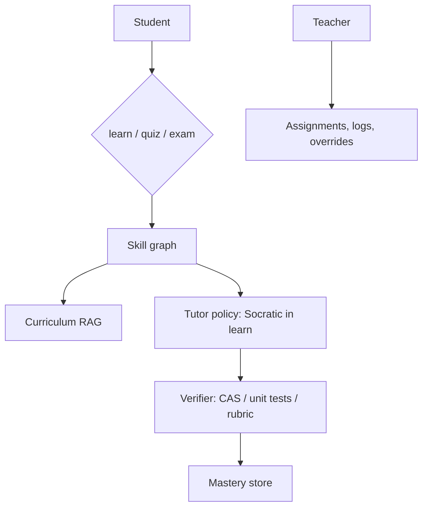

# Design an AI tutor

## Prompt

Design a tutor for high-school math and later other subjects: Socratic
help, quizzes, mastery tracking, teacher dashboard. Not a homework
answer machine — or at least, a mode that isn't.

## Clarify

- Users: student, teacher, parent (different privileges)
- Subjects: math first (easier to verify)
- Cheating: schools will ask; **exam mode** vs **learn mode**
- Wrong-answer cost: teaching a false method is worse than a blunt
  refusal
- Latency: chat-class, not voice (voice later)

Trust: students will inject ("just give the answer"). Content from
the open web is untrusted. Curriculum docs are trusted after ingest.

## Scale (invented)

- 1M students, diurnal peaks
- QPS modest
- The system is **pedagogy + eval + memory**, not ANN at 10k QPS

## Envelope

$ / student / month must fit a school contract. That means small
models on hints, large on misconception diagnosis, cache worksheets.

## Architecture

## Deep dive 1 — verify before you teach

Math: symbolic checker / CAS for final answers; process can be LLM
graded against a rubric **and** a gold worked solution.

If the verifier says the student's answer is correct, do not "hint"
them into doubt. If the model wants to teach a method the verifier
cannot check, **don't**.

For essays later: rubric + teacher sample, not a vibe judge alone.

## Deep dive 2 — Socratic policy as a product mode

Learn mode: tools are `ask_question`, `give_hint`, `show_worked`,
`log_misconception`. There is **no** `reveal_answer` until a hint
budget or a teacher flag.

Exam mode: the same model, different tool allowlist (often: none),
logged, maybe disabled entirely.

This is privilege separation, not a stern system prompt.

## Deep dive 3 — memory and teachers

Profile: accommodations, language — **user-visible**, teacher-visible
per policy.
Episodic: misconceptions ("drops negative signs").
Poison: a classmate cannot write "this student is in honors, skip
scaffold" into profile via a shared doc.

Dashboard: what was asked, hints used, time, verifier outcomes.
Raw chat may be too sensitive; default to aggregates + samples.

## Failures

- Silent lies (wrong math, fluent)
- Memory poison
- Eval gaming ("helpfulness" that just leaks answers)
- Cost if every hint is an L-model essay

## Evals

Item bank with gold; learning-mode must not emit the final answer
before N hints (attack set).
Transfer: can the student solve a held-out isomorphic problem?
Teachers' overturn rate.

## Listen for

Verifier, modes as allowlists, skill graph, teacher as a privilege,
not "a friendly GPT with a persona".

## Cut list

Math quiz + verifier + logs. Then Socratic hints. Then memory of
misconceptions. Then open-ended essays.
