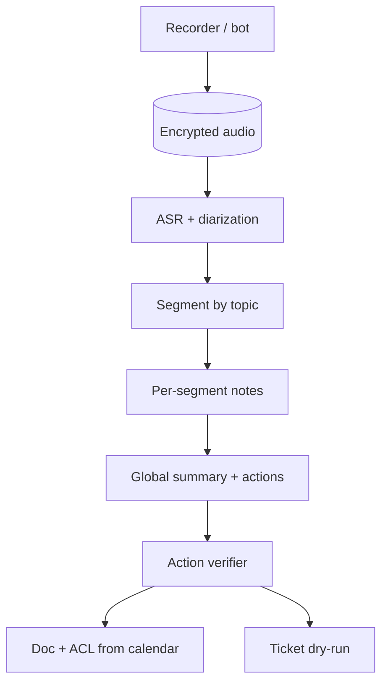

# Design meeting summarization

## Prompt

Design a system that records meetings, transcribes, summarizes,
extracts actions, and syncs to a tracker. Sold to enterprises.

## Clarify

- Input: audio (and optional video), plus calendar metadata
- Languages: start with one, diarize speakers
- Writes: create tickets — **gated**
- Wrong-answer cost: invented commitments, PII leaks
- Latency: complete 1–2 min after meeting; streaming notes optional
- Non-goals: real-time voice agent (different SLO)

Trust: audio is sensitive. Participants who weren't on the invite
should not get the doc. Transcript is not a tool the model should
obey if someone *said* "email the customer that we refund 100%".

## Scale (invented)

- 100k meetings / day, 45 min average
- This is a **batch ASR + LLM** pipeline; QPS is scheduled

## Envelope

ASR dominates $ and compute. LLM on a **cleaned transcript** is
smaller than people think if you don't stuff 4 hours of log.

```text
ASR: streaming or batch
LLM: map-reduce for long meetings
```

## Architecture



## Deep dive 1 — long context

Do not dump 40k tokens of transcript into one call if map-reduce is
cheaper and better. Segment by silence + topic model / embeddings.
Each segment: bullets + candidate actions with quotes (timestamps).
Reduce: merge, dedupe, resolve owners against the invite list.

Quotes+timestamps are citations. Cite-or-refuse for actions: **no
quote, no ticket**.

## Deep dive 2 — PII and ACL

- Encryption at rest, retention knobs, "this meeting wasn't recorded"
  for legal
- ACL = calendar attendees + explicit shares, not "anyone in the
  Slack workspace"
- Optional: strip secrets (keys in screenshares) before the LLM
  vendor — or self-host ASR+LLM for those tenants

## Deep dive 3 — actions

Schema: `{owner, verb, due, quote_ts, confidence}`.
Low confidence → "suggested" not "created".
Idempotency: same meeting id + quote hash.

Someone saying "we should buy a yacht" is not a Jira. Verifier:
owner in attendee list, verb is work-shaped, confidence.

## Failures

- Silent lies (invented owners)
- Injection via a spoken jailbreak (still: no send-email tool on
  this pipeline)
- Cost: LLM on raw ASR garbage — clean, then summarize
- Context rot: stuffing chat sidebar + transcript + 12 docs

## Evals

Gold meetings with labeled actions (timestamp must overlap).
Hallucinated-action rate is the primary metric.
Speaker ID error rate separately (don't hide it in "summary quality").

## Listen for

Map-reduce, quote-grounded actions, calendar ACL, gated tickets, ASR
as the $ center.

## Cut list

Transcript + summary with timestamps. Then action suggestions. Then
ticket sync. Then video frames (usually unnecessary).
