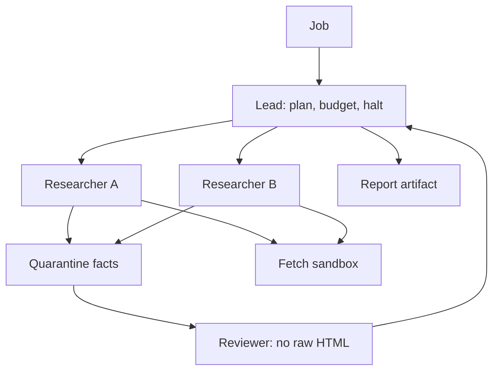

# Design a multi-agent research system

## Prompt

Design a system that takes a hard question ("compare the last four
10-Ks of these firms on risk factors") and returns a sourced report
after minutes of work. Multiple specialist roles are in fashion.
Defend or reject them.

## Clarify

- Time budget: 2–10 minutes
- Tools: search, fetch, code (tables), not email
- Output: report with citations + a trail
- Wrong-answer cost: high if used for investment / legal — **label
  it as assistive**
- Non-goals: fully autonomous company-running agents

Trust: the web is hostile. **Researchers read; only a gated publisher
writes the final artifact.**

## Scale (invented)

- 20 QPS of jobs is already a lot (each job = 50–200 model calls)
- Queue + worker pool. This is batch with a websocket for progress

## Envelope

```text
$ / job can be $1–$20 if you are sloppy
budget object on the job: max_usd, max_fetches, max_steps
```

Show a worked budget: 30 fetches, 15 L calls, 40 S calls.

## Architecture



**Why multiple agents:** different **privileges and prompts**, not
theatre. Researchers: fetch. Reviewer: contradiction checks on the
fact list. Lead: halt and budget. If you cannot name a privilege
difference, use one loop.

## Deep dive 1 — shared memory is an artifact store

Do not pass 80-page HTML between agents. Pass:

```text
Fact {id, claim, quote, url, ts, confidence}
Gap {question}
Artifact {report.md}
```

This is [memory](../topics/08-memory.md) for a job: working +
episodic (the fact log). Poison: a page cannot insert a fact without
a quote the reviewer can open.

## Deep dive 2 — parallelism vs thrash

Fan-out researchers on **disjoint subquestions** from the plan.
Merge in the fact store with dedup (embedding + URL).
Lead re-plans only on `budget remaining` and `gaps`, not every turn.

Loop detector across agents: same URL fetched twice globally.

## Deep dive 3 — the report

Cite fact ids. Verifier: every sentence with a claim maps to a fact
or is marked as inference. Investment use: watermark "not advice"
and keep the trail.

## Failures

- Loops (the default)
- Injection via a 10-K HTML copy on a random blog
- Cost blowups
- Eval gaming ("report has headings")
- Reviewer that shares the researcher prompt (no isolation)

## Evals

Gold questions with a **source set** you control (offline cache of
pages) so CI is deterministic.
Metrics: claim-level groundedness, coverage of gold points, $ / job,
injection suite.

## Listen for

"I won't multi-agent unless privileges differ", quarantine facts,
job-level budget, deterministic eval corpus, no email tool.

## Cut list

One agent, fetch+cite, budget. Then a reviewer on facts. Then
parallel researchers. Then code tools for tables.
