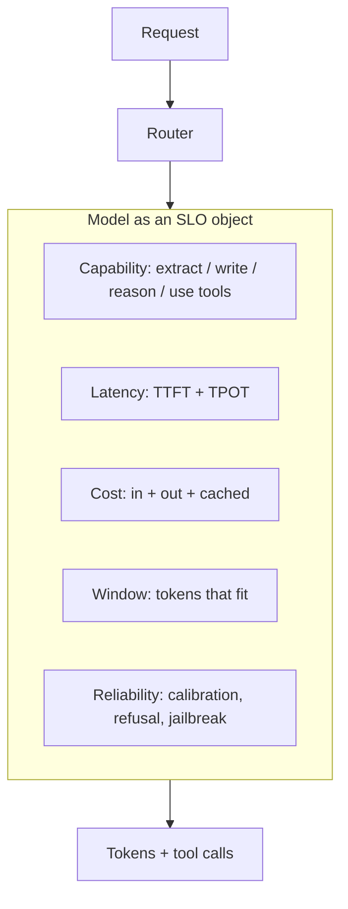

# The systems model of an LLM

**Default:** Treat the model as a *capability SLO object* — a function with
latency, cost, context limit, tool skill, and a reliability curve — not as
a mind and not as a single API you call the same way for every request.

## The object

You do not "use GPT". You pick a point on a Pareto surface. Interviewers
listen for whether you can move on that surface on purpose.

## What the model actually is, for an engineer

Strip the mysticism down to the properties that hit production:

| Property | Why it matters | What you do with it |
| --- | --- | --- |
| **Next-token sampler** | Fluency ≠ truth | Never trust a fact you did not retrieve or compute |
| **Fixed context window** | Working set is finite | Admission control for tokens |
| **Prefill vs decode** | Prefill is parallel-ish; decode is serial | TTFT vs streaming UX are different knobs |
| **Prompt cache / prefix cache** | Shared prefixes are almost free on replay | Stable system prompts, stable tool schemas |
| **Tokenizer** | Cost and "length" are in tokens, not words | Count tokens; do not count English |
| **Tool-call channel** | Side effects leave the text universe | Treat tool JSON as an untrusted RPC |
| **Structured output** | Schema is a decoder, not a guarantee | Validate; retry; fall back |

You do not need the math of attention to design a system. You do need to
know that **lost-in-the-middle is real**: models use the start and end of
a prompt more reliably than the middle. Put instructions and the current
question at the edges. Put retrieved blobs in the middle, ranked.

## Capability is not a boolean

A useful internal rubric (name yours; keep it stable):

| Grade | The model can | Use it for |
| --- | --- | --- |
| **S** | Follow a short schema, classify, extract | Routers, filters, structured extractors |
| **M** | RAG answer, light tool use, rewrite | Default product path |
| **L** | Hard reasoning, messy tools, adversarial text | Escalation, planning, eval-fail retries |
| **L+** | Long-horizon, computer use, codebases | Agents with tight budgets and human gates |

Route **S → M → L**. Paying L prices for S work is how chat products go
insolvent. Putting S models on L work is how you ship confident nonsense.

## Reliability is a curve, not a vibe

Ask, for each task:

- **Precision vs recall.** Support-bot refunds need precision. Search needs
  recall, then a rerank.
- **Calibration.** Does "I don't know" actually mean that?
- **Stability.** Same prompt, temperature 0, still moves across model
  versions. Pin versions for prod.
- **Adversarial.** The prompt is not only your user's.

Evals (see [Evals](09-evals.md)) are how you draw this curve. A/B tests
measure what users click. They do not measure whether the legal citation
was real.

## What interviewers listen for

- You separate **prefill** (prompt processing) from **decode** (token
  generation). TTFT is mostly prefill + queueing; complete-answer latency
  is decode.
- You mention **prompt cache** as a first-class cost lever, not a trivia
  fact.
- You refuse to pick "the smartest model" as a default.
- You can explain why a 1M-token window does not make RAG obsolete:
  quality, cost, and lost-in-the-middle all still argue for retrieval.

## Failures this model predicts

- [Context rot](../failures/05-context-rot.md) — you admitted junk to the
  working set
- [Cost blowups](../failures/06-cost-blowups.md) — you paid decode + retry
  without a budget
- [Tool hallucination](../failures/07-tool-hallucination.md) — you treated
  the RPC channel as English
