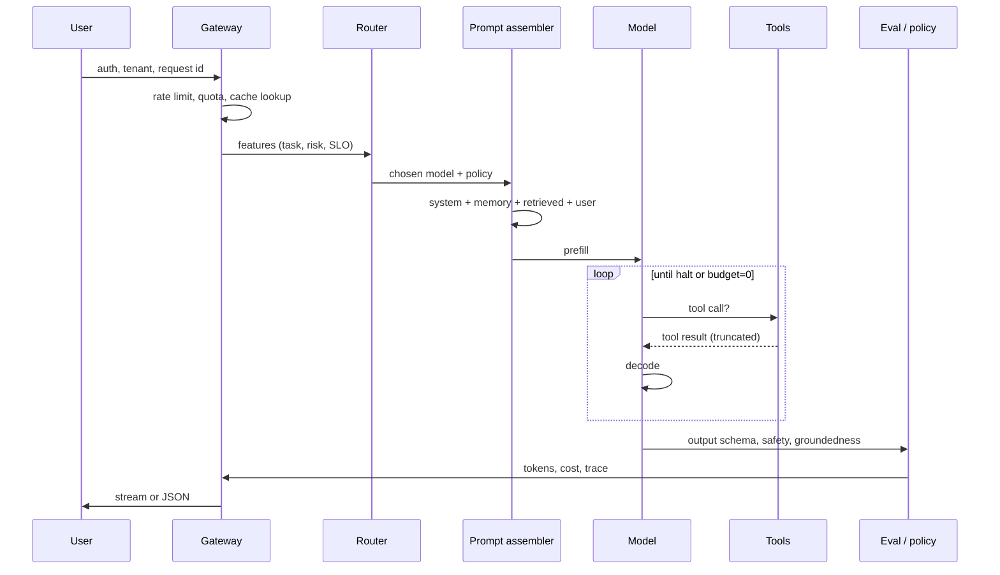

# The request path

**Default:** Draw one request as a traced pipeline with a budget object.
If a token, a tool call, or a retry cannot be attributed to a span, you
cannot operate the system.

## The path



Every box is a place to cache, fail, or get prompted-injected. Name them.

## The budget object

Attach this to the request id. Enforce it in the gateway, not in the
prompt ("please don't loop").

```text
Budget {
  max_tokens_in
  max_tokens_out
  max_tool_calls
  max_wall_ms
  max_usd
  max_retries
  side_effects: read | write | irreversible
}
```

When any counter trips: halt, return the best partial, or escalate to a
human. Do not "one more try" inside the model loop without debiting the
budget. That is how [cost blowups](../failures/06-cost-blowups.md) start.

## Prompt assembly is a real component

Do not concatenate strings in the handler. A prompt assembler:

1. Starts from a **versioned** system prompt (id + hash in the trace)
2. Inserts **only the memory** that the policy allows for this tenant
3. Inserts **retrieved evidence** with IDs the model must cite
4. Inserts **tool schemas** (stable, for cache hits)
5. Places the **user turn** at the end
6. Truncates from the *least useful* middle, never from the instruction

Log the assembled prompt in a redacted form. You will not debug "the model
was weird" without it.

## Caching, in the order you should try it

| Layer | Key | Invalidation | Wins |
| --- | --- | --- | --- |
| HTTP / CDN | exact request | TTL | identical FAQs |
| Semantic response cache | embedding of user+tenant+policy | TTL + corpus version | paraphrases |
| Prompt prefix cache | token prefix | prompt/tool schema change | every turn of a chat |
| Retrieval cache | query embedding | index version | repeated questions |
| Tool cache | idempotent GETs | data TTL | CRM lookups |

Semantic caches can serve a wrong answer forever. Key them on
**index generation** and **policy version**, not just the text.

## Streaming

Stream tokens to the user for UX. Do **not** stream side effects. Buffer
tool calls, validate arguments, then execute. If you stream a refund
decision, you will refund.

For structured JSON, stream only after the schema validator is satisfied,
or stream a side-channel of "thinking" that is not the product contract.

## What interviewers listen for

- A **request id** that follows the user, the model, and every tool
- Rate limits in **tokens and dollars**, not just QPS
- A cache story that mentions **invalidation**
- Separation of **control plane** (prompts, policies, model pins) from
  **data plane** (user text, retrieved docs, tool dumps)

Next: [Context](03-context.md) — what you are allowed to put on this path.
