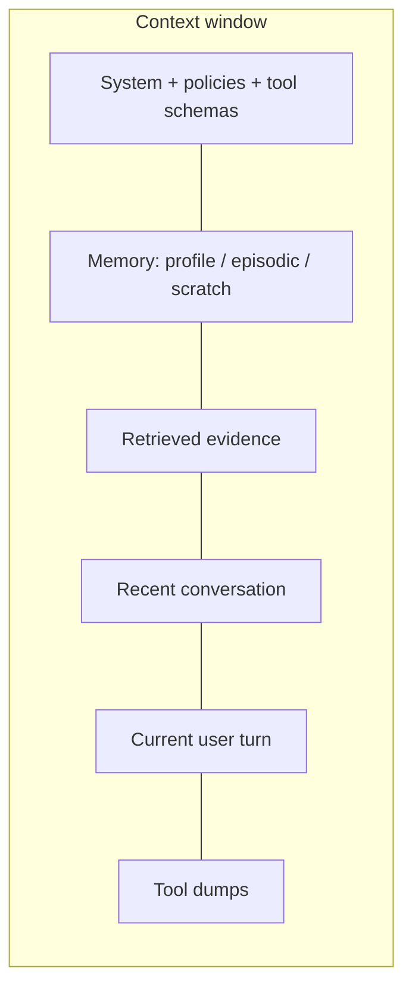

# Context is a scarce resource

**Default:** Treat the prompt as a working set with an admission policy.
Every token should earn its place. Long context windows made the working
set larger. They did not make it free, clean, or equally attended to.

## The working set

Put **instructions and the current question at the edges**. Models attend
more reliably to the start and the end. The middle is where you store
evidence, and where [context rot](../failures/05-context-rot.md) breeds.

## Admission control

When the window is full you must drop something. Pick a policy and make it
visible in the trace:

| Policy | Drop first | Use when |
| --- | --- | --- |
| **Recency** | Oldest turns | Short chats, no RAG |
| **Relevance** | Lowest-score chunks | RAG |
| **Authority** | Untrusted web / email | Browsing agents |
| **Cost** | Tool dumps over 2k tokens | Agents |
| **Pinned** | Never drop system + user turn | Always |

A bad policy is "summarize the whole history into a paragraph and hope".
Summaries lose the one number the user will notice. If you summarize,
summarize *episodic memory* in the memory system, not the live turn.

## Long context vs RAG

Use this table; do not treat it as religion.

| Situation | Prefer | Why |
| --- | --- | --- |
| One PDF, user is in it now | Long context | Retrieval can miss the paragraph they mean |
| 10k docs, changing daily | RAG | Cost, freshness, citations |
| Legal / medical citations | RAG + cite-or-refuse | You need IDs |
| Repo-wide coding | Hybrid: retrieve files, then long-context the working set | See [coding assistant](../interviews/04-coding-assistant.md) |
| "Just stuff it all in" | Usually a cost and quality bug | Lost-in-the-middle + decode cost |

A 1M-token window still charges you for prefill. Prefix cache helps when
the blob is **stable**. A unique 400-page dump on every request is how
you discover the finance team's Slack.

## Tool dumps are hostile to context

Tools return logs, HTML, and JSON. That is attacker-controlled, bulky, and
low-signal. Rules:

- Truncate tool results to a hard cap (e.g. 1–2k tokens) with a
  `truncated: true` marker
- Prefer *extracted fields* over raw payloads
- Never dump a previous tool result back in on the next turn unless the
  model asked to inspect it
- Sanitize. This is the main door for
  [prompt injection](../failures/04-prompt-injection.md)

## Prompt packing recipe

1. System prompt: short, pinned, versioned
2. Tool schemas: stable (cache)
3. Memory: only the slice this task needs
4. Evidence: top-k chunks with IDs, ranked best-first or best-last
   (experiment; measure)
5. User turn
6. If over budget: drop evidence from the middle of the ranked list, then
   old chat, then memory. Never drop (1) or (5)

## What interviewers listen for

- You say **working set**, not "we'll use the 1M model"
- You have a **truncation policy**
- You know **lost-in-the-middle**
- You treat **tool output as untrusted data**, not as more prompt
