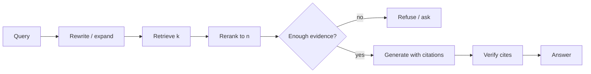

# RAG

**Default:** Start with *cite-or-refuse* RAG: retrieve, rerank, generate
only from cited chunks, refuse when evidence is weak. Do not start with
agents, graphs, or "self-RAG" loops. Add those when an eval says naive
RAG has a specific, measured failure.

## Recommendation in one picture

The product is the **verifier**, not the generator. If the model cannot
point at chunk IDs, the answer is a leak.

## When not to use RAG

- The fact lives in a database. **Query the database.** LLMs are worse
  SQL than SQL.
- The user is asking the model to *transform* text they already pasted.
  There is nothing to retrieve.
- You need a guaranteed decision (refund under policy X). Compile the
  policy into code or a rules engine; use the model to extract slots.
- Your corpus is three FAQ pages. Grep / BM25 will beat a vector demo.

RAG is for **unstructured, changing, too-big-to-stuff** text where
citation matters.

## The four RAG designs you will be asked to choose

| Design | Loop | Use when | Cost |
| --- | --- | --- | --- |
| **Naive** | retrieve → generate | FAQ, homogeneous docs | Lowest |
| **HyDE / rewrite** | rewrite query → retrieve → generate | User queries are slang, short, or multilingual | +1 small model call |
| **Rerank** | retrieve 50 → cross-encoder 5 → generate | Mixed corpus, precision matters | Cheap vs generation |
| **Agentic** | model issues search calls until halt | Multi-hop, "compare these filings" | Easy to [loop](../failures/02-agent-loops.md) |

Graph RAG and hierarchical summarization are real, and they are how
people avoid measuring chunking. Introduce a graph when entities and
relations are the product (investigations, code, org charts), not because
a blog post said so.

## Cite-or-refuse

The system prompt is not enough. Enforce in code:

1. The generator may only quote from provided chunk IDs
2. A cheap verifier checks that cited IDs exist and that the claim
   overlaps the chunk (embedding similarity or NLI)
3. If the verifier fails: refuse or retrieve-again **once**, then stop

This is the antidote to [silent lies](../failures/01-rag-silent-lies.md).
Users prefer "I don't see that in the handbook" to a fluent invention.

## Freshness and tenancy

Two production killers:

- **Index generation.** Every answer must carry `index_id`. Cache keys
  include it. Rebuilds do not serve yesterday's policy PDF.
- **Tenancy.** Embeddings from customer A must be unreachable from
  customer B. Filter on `tenant_id` in the retriever, not in the prompt
  ("please don't search other tenants").

ACL filters belong in the retrieval query (`tenant=… AND acl IN user_roles`).
Prompt-level isolation is not isolation.

## Hybrid search is the default in 2026

Pure dense retrieval misses SKUs, error codes, and names. Pure BM25 misses
paraphrases. **Hybrid (BM25 + dense) + rerank** is the boring design that
wins evals. Tune the fusion weights on your corpus, not on a tweet.

## What interviewers listen for

- You asked about **corpus size, update rate, and ACLs** before picking
  Pinecone vs pgvector
- You put a **reranker** in the diagram without being asked
- You have a **refuse** path
- You can say what **agentic RAG** is for, and why you will not start there

Deep dive on the index itself: [Chunking, embeddings, retrieval](05-retrieval.md).
