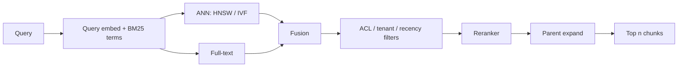

# Chunking, embeddings, retrieval

**Default:** Chunk by *semantic unit* (section, function, issue), not by
raw token count. Index **hybrid** (sparse + dense). Retrieve 20–50,
rerank to 3–8, then generate. If you cannot open a retrieved chunk and
see why it matched, you cannot debug RAG.

## Chunking

Chunking is the load-bearing design decision people skip.

| Strategy | Good for | Failure |
| --- | --- | --- |
| Fixed 512 tokens, 50 overlap | Homogeneous wiki | Splits tables and policies in half |
| By heading / Markdown AST | Handbooks, docs | Messy HTML, slides |
| By function / class | Code | Misses cross-file contracts |
| Parent-child (small index, large expand) | Precise hit, broad generate | Complexity; parent can still be huge |
| Proposition / fact split | FAQ, support | Expensive preprocess; can destroy narrative |

**Recipe:**

1. Parse to a tree (headings, code symbols, tickets)
2. Emit chunks that are complete enough to stand alone
3. Store **parent_id** so you can expand at generate time
4. Store **metadata**: tenant, ACL, source URI, title, updated_at, hash
5. Never drop the title. Prepend `Document: Refund policy v3 §2.1`

A 128-token chunk retrieves precisely and generates blindly. A 2k-token
chunk retrieves mush and generates with plenty of evidence. Start around
300–800 tokens for prose, smaller for code, and **measure**.

## Embeddings

Embeddings are a lossy hash of meaning. They are not a database.

- **Pin the model.** Mixing embedding versions in one index is a silent
  incident. Store `embedding_model` on the index generation.
- **Embed the query the same way you embedded documents.** If you prepend
  titles on docs, consider a query prefix too (`search_query:` /
  `search_document:` where the model family wants it).
- **Do not embed PII you are not allowed to index.** Redact before embed.
- **Multilingual:** either a multilingual embedder or a translate-then-
  embed step. Do not hope.

Dimension and MIPS vs cosine are secondary. The product question is:
**does nearest neighbor on this corpus return the paragraph a human would
highlight?** That is an eval, not a vendor slide.

## Retrieval stack

**ANN choice (interview-level, not a bakeoff):**

- **HNSW:** great default, memory-heavy, excellent recall
- **IVF / PQ:** cheaper at huge scale, more tuning
- **Postgres + pgvector:** winning when ops simplicity and ACLs in SQL
  matter more than max QPS
- **Split indexes per tenant** when isolation > global recall

Filters must run **in the retriever** (`WHERE tenant_id = …`). Retrieving
globally and then dropping hits is how you leak, or how you return nothing
and the model starts riffing.

## Reranking

Bi-encoders (your embedder) are fast and coarse. A **cross-encoder
reranker** looks at `(query, chunk)` jointly. It is the cheapest quality
win in most RAG stacks. Retrieve 50, rerank to 5.

If you cannot afford a reranker, you probably cannot afford the wrong
answer either. Try a small model as reranker before you skip this layer.

## Debugging a miss

When a known-good doc does not retrieve:

1. Did we **ingest** it? (hash, index_id)
2. Did **chunking** split the answer apart from the keywords?
3. Is **ACL** filtering it out?
4. Is the **query** too unlike the chunk (need rewrite / HyDE)?
5. Is **BM25** failing on an error code the embedder ate?

Log `query, hit_ids, scores, chosen_ids` on every request. RAG without
this log is a vibe.

## What interviewers listen for

- Metadata and ACLs in the index schema
- Hybrid search
- A rerank step
- Parent-child or expand-on-generate
- An ingest pipeline: parse → chunk → embed → index → **generation number**
