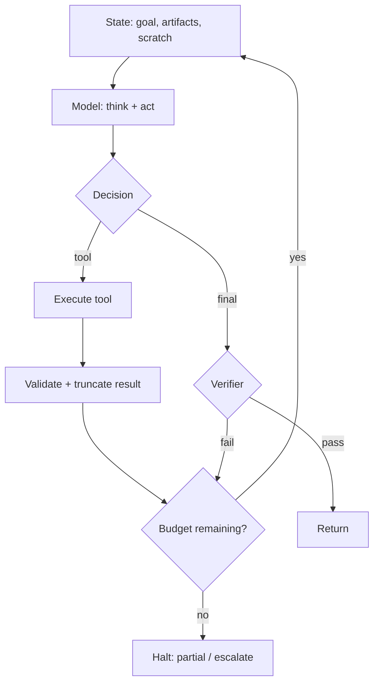

# Agents are loops

**Default:** Do not start with an agent. Start with a DAG or a single
model call. Promote to an agent when the eval shows the task is
*multi-step with unknown control flow*. Then draw a **while-loop**:
state, tools, halt conditions, and a budget. If you cannot draw the
loop, you do not have an agent. You have a demo.

## The loop



That is the entire idea. Frameworks are how you serialize this loop.
They are not the architecture.

## When an agent is justified

| Signal | Agent? | Better alternative |
| --- | --- | --- |
| Fixed 4-step workflow | No | DAG / workflow engine |
| Must choose among tools based on the user | Maybe | Router + specialized DAGs |
| Multi-hop unknown sequence ("figure out why prod is down") | Yes | Agent with tight tools |
| Needs a side effect (file a ticket, edit a repo) | Yes, with gates | Human-in-the-loop |
| "Autonomous research for 40 minutes" | Only with checkpoints | See [multi-agent research](../interviews/18-multi-agent-research.md) |

The industry habit is to call every LLM app an agent. Interviewers
notice if you do that.

## Halt conditions

Write these in code. Prompts do not halt.

- **Success:** verifier says the goal is met (tests pass, schema valid,
  user question cited)
- **User:** the model asks a clarifying question (counts as halt)
- **Budget:** tokens, dollars, wall clock, tool calls
- **Loop detector:** same tool + same args, or state hash repeats
- **Policy:** attempted irreversible action without a gate
- **Uncertainty:** model or verifier confidence below threshold → escalate

Missing halt conditions are [agent loops](../failures/02-agent-loops.md).

## State

State is not "the chat log". Chat logs rot. Keep:

```text
Goal (immutable after confirm)
Plan (optional, rewritten, versioned)
Artifacts (files, URLs, ticket ids)   // the product
Scratch (last tool errors)            // small
Memory pointers (not dumps)
```

Pass artifacts by **reference**. If the agent wrote a 4k spec, store it
and put `artifact://spec-12` in the working set, not the spec itself.

## Side effects

Split tools into **read**, **write**, **irreversible**.

- Reads can run in the loop
- Writes need idempotency keys
- Irreversible (email, pay, delete, merge, post publicly) need a **gate**:
  a human, a second policy model, or a dry-run diff

Never let the same loop that *reads untrusted web text* also *send email*
without a gate. That is how [prompt injection](../failures/04-prompt-injection.md)
becomes an incident.

## Single agent vs multi-agent

Multi-agent is extra process boundaries. Use it when you need:

- **Heterogeneous privileges** (researcher can browse; buyer cannot)
- **Heterogeneous models** (cheap writer, expensive reviewer)
- **Isolation** (reviewer does not see the raw web page, only a quote list)

Do not use it because "a team of agents" sounds like a company. Every
extra agent is another prompt to inject, another loop to budget, another
trace to join. See [multi-agent research](../interviews/18-multi-agent-research.md).

## What interviewers listen for

- You asked "why isn't this a DAG?"
- A **budget object** in the diagram
- **Halt** as code, not as a hope
- **Gated side effects**
- A **verifier** that is not the same model in the same prompt
