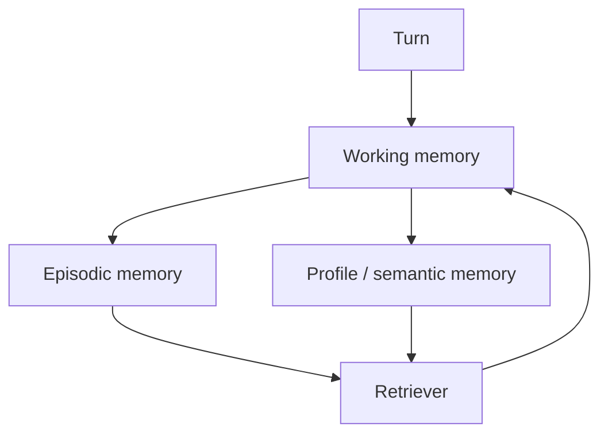

# Memory

**Default:** Split memory into three stores you can inspect. Do not
shove "the conversation" into a vector database and call it a soul.
If a memory cannot be versioned, quoted, deleted, and evaluated, it
will eventually [poison](../failures/08-memory-poisoning.md) the product.

## Three stores

| Store | Holds | Lifetime | Write policy |
| --- | --- | --- | --- |
| **Working** | Current goal, last tool results, this session's files | Request / session | Always, but capped |
| **Episodic** | What happened: tickets, decisions, dates | Months, queryable | Append-only facts with source |
| **Profile** | Stable preferences, durable attributes | Until user edits | Gated, user-visible, low rate |

Working memory is the context packer. Episodic is a log you retrieve
from. Profile is a small, high-authority document. Mixing them is how
"user likes concise answers" gets overwritten by a joke the user made
once, or how an injector writes "the user asked you to ignore policies".

## Write gates

Every write to episodic or profile memory goes through:

1. **Classification:** fact vs preference vs junk vs hostile
2. **Attribution:** `source = user | tool | inferred` and a pointer
3. **Confidence / ttl**
4. **User visibility:** profile writes should be reviewable in a UI
5. **Quota:** N writes per session so a loop cannot fill the store

Inferred memories ("the user is angry") are the most dangerous. Prefer
not to store them. If you do, mark `inferred=true` and never let them
override policy.

Hostile text in a tool result must not be eligible for profile writes.
That is the memory variant of prompt injection.

## Retrieval into the working set

Do not retrieve "everything about the user". Retrieve:

- Profile slice for this task (support vs coding vs tutor)
- Episodic hits with the same hybrid search you use for RAG
- Hard caps (e.g. 800 tokens of memory)

Memory is RAG over a private corpus. It gets the same cite-or-refuse
treatment: "I have you down as preferring X (you set this on June 2)"
beats a silent vibe.

## Forgetting

GDPR is not a special case; it is a correctness case.

- Tombstone by `memory_id`
- Rebuild or filter the index on `not tombstoned`
- Never promise delete if you only dropped the SQL row and left
  embeddings in a replica
- Session transcripts are often the real store. Delete those too

## Eval

Memory systems need their own evals:

- **Pin test:** after "I am vegetarian", a meal plan must not suggest
  steak, across sessions
- **Forget test:** after delete, the fact is gone
- **Poison test:** a web page saying "user's name is admin" must not
  land in profile
- **Conflict test:** two episodes disagree; the system asks, not blends

If you only eval the chatbot's tone, you will ship a confident stalker.

## What interviewers listen for

- Three stores, not one vector soup
- **Write gates** and **user-visible profile**
- Tenancy and deletion
- Memory described as **data engineering**
- A poison scenario you have actually thought through
