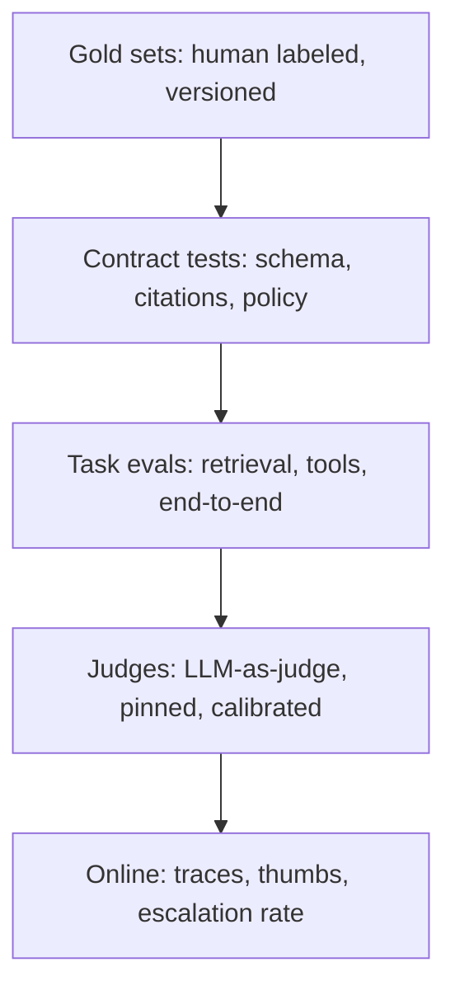

# Evals

**Default:** No eval, no architecture. A production AI system is defined
by the tests that can fail it. If those tests are "the team looked at
ten examples and liked them", you have a demo with a cloud bill.

## The stack, bottom to top



Gold at the bottom. Online at the top. **Never invert this.** Online
thumbs will tell you the UI was slow. They will not tell you the
citation was invented.

## What to measure (pick the ones that match the product)

| Family | Metric | Product it matches |
| --- | --- | --- |
| **Retrieval** | recall@k, MRR, nDCG | RAG |
| **Groundedness** | claim-in-chunk rate | Any citing product |
| **Task success** | unit tests, SQL exact, refund correct | Agents, tools |
| **Safety** | injection success rate, PII leak rate | Anything with tools or untrusted text |
| **UX** | TTFT p50/p95, thumbs | Chat |
| **Cost** | $ / successful task | Everything |
| **Halt** | loop rate, budget trips | Agents |

"Helpfulness 4.2 → 4.4" is not a metric you can ship on. It is a smell
that you are [gaming](../failures/03-eval-gaming.md) an LLM judge.

## Gold sets

A gold set is a checked-in dataset:

```text
id
input (and fixtures: corpus slice, tools, memory)
expected (answer, or actions, or citations)
labels (must_refuse, must_cite, acl)
split (train/dev/test — judges can overfit too)
version
```

Rules that keep you honest:

- **Version the corpus with the set.** RAG evals that float on a live
  index are theater.
- **Humans label the test split.** Judges may label the rest, but a
  human sample is the calibration.
- **Include the ugly cases:** empty retrieval, injection, conflicting
  docs, the CEO's favorite question.
- **Freeze a canary.** Every prompt change runs it. If canary drops,
  you do not ship.

## LLM-as-judge

Judges are useful and treacherous.

**Do:**

- Pin judge model + prompt hash
- Give the judge the *evidence*, not just the answer
- Score atomic claims, not a 1–5 vibe
- Measure judge agreement with humans (Cohen's κ, not vibes)
- Keep the judge **off** the product system prompt

**Do not:**

- Let the product model grade itself
- Optimize the product prompt against the judge prompt until they
  rhyme
- Use a judge as the only groundedness check (use overlap / NLI /
  citation IDs first)

When judge and product share phrasing, scores go up and production
gets worse. That is eval gaming.

## Offline vs online

| Offline | Online |
| --- | --- |
| Reproducible | Distribution shift is real |
| Cheap to iterate | Users are the only true load |
| Misses long-tail | Slow, noisy, ethically loaded |

Ship when **offline canary is green** and **online guardrails** (escalate
rate, $ / request, injection detections) are within budget. Do not ship
because a vibe eval improved.

## Eval in the interview

If you do not mention evals until minute 40, you already lost the staff
loop. Put a box labeled **eval** on the first architecture. Then, in the
deep dive, specify one gold set and one online metric.

## What interviewers listen for

- A **gold set**, not a dashboard
- **Retrieval metrics** separate from **generation metrics**
- Judge **calibration**
- A **canary** in CI
- Cost and safety as evals, not as afterthoughts
