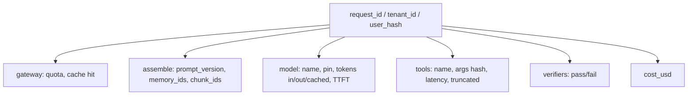

# Observability

**Default:** One request id, one trace, every model call and tool call
a span. If you cannot answer "why did we say that?" from a trace, you
cannot operate an AI product. Logs of the final string are not enough.

## The trace

Store:

- **Prompt version** (id + hash), not necessarily the raw prompt in the
  hot path — raw prompts may contain PII; put those in a redacted store
  with access control
- **Chunk IDs and scores**
- **Tool arguments** (redact secrets)
- **Token counts** split in / out / cached
- **Model pin**
- **Cache hit layers**
- **Policy decisions** (why routed to L, why refused)

This is how you debug silent lies. "The model hallucinated" is usually
"we retrieved chunk 77 with score 0.12 and generated anyway".

## Metrics that deserve dashboards

| Metric | Alert when |
| --- | --- |
| $ / request, $ / day | budget +20% |
| tokens_out / request | sudden verbosity or hidden reasoning leak |
| retry rate, tool-call count | loops |
| cache hit rate (prefix + retrieval) | prompt edits that break prefixes |
| refuse rate, escalate rate | quality or policy shift |
| groundedness fail rate | RAG ingest breakage |
| TTFT p50/p95 | capacity |
| injection detector hits | active attack |

Thumbs-up rate is a product metric. Put it next to these, not instead of
them.

## Privacy

Traces are a second copy of user data.

- Hash user ids in the default view
- Redact secrets and payment fields at the gateway
- Retention: days for raw prompts, months for aggregates
- Tenant isolation in the observability store, not just the product

A debugging tool that lets any employee search prompts is a compliance
incident waiting for a date.

## Replaying

You want **replay**: take a production trace, freeze the corpus
generation and model pin, re-run the assembler and the model. This is
how you test a prompt change against last week's incidents.

Replay requires storing enough (prompt hash, chunk ids, tool fixtures).
It does not require storing every decode token forever.

## What interviewers listen for

- Traces, not log lines
- Token and **dollar** metrics
- PII story
- Replay
- Connecting a bad answer to **retrieval scores** or **a tool dump**
