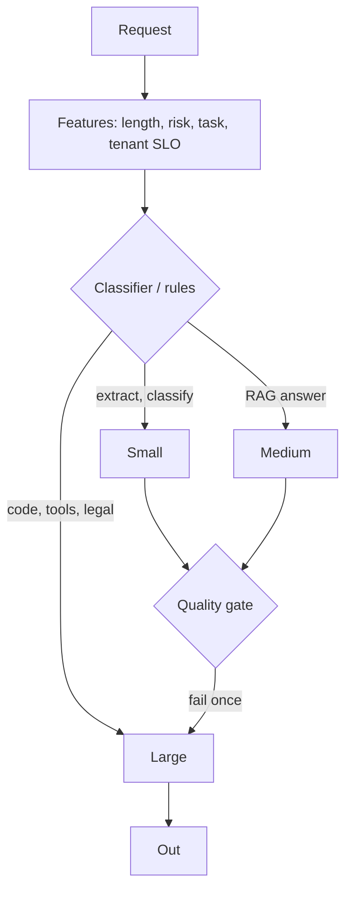

# Cost, latency, routing

**Default:** Give every request a dollar budget and a latency SLO, then
**route** to the cheapest model that still passes the eval for that
task. Output tokens, retries, and uncached prefill are the three knobs
that actually move the bill. Everything else is a rounding error until
you are huge.

## The bill

Approximate, as ratios (update the $ when you ship):

```text
cost ≈
    tokens_in  * p_in  * (1 - cache_hit)
  + tokens_in  * p_cached * cache_hit
  + tokens_out * p_out
  + tools      * p_tool
  + retries    * (the above)
```

Usually `p_out` is several times `p_in`, and `p_cached` is a small
fraction of `p_in`. That is why:

- A chatty agent is more expensive than a smarter one-shot
- A stable system prompt is an infrastructure investment
- "Let's retry with the big model" is often the whole outage

See [cost blowups](../failures/06-cost-blowups.md).

## Latency is two numbers

| Number | User feels it as | You tune |
| --- | --- | --- |
| **TTFT** | "it started" | queueing, prefill, prompt size, cache |
| **Time-to-complete** | "it finished" | decode speed × tokens_out, tools |

Streaming makes TTFT the UX. It does not make a 2,000-token essay fast.
If the product can answer in 80 tokens, **constrain max_tokens** and
prompt for brevity. This is both a cost and a latency feature.

Voice and pair-programming have TTFT budgets measured in hundreds of
milliseconds. Batch summarization does not. Do not use one SLO.

## Routing



**Rules beat a learned router** until you have volume. A learned router
needs an eval, or it will send everything to L "to be safe" (your bill)
or everything to S "to be cheap" (your quality).

Escalate **once**. An escalate storm is a loop.

## Capacity

You will be asked about GPUs. Stay at the systems level unless they
push:

- **Batching** raises throughput and TTFT. Interactive chat wants small
  batches; batch jobs want large.
- **Prefill vs decode** can be disaggregated at scale.
- **Speculative decoding** / draft models help decode if quality holds.
- **Queueing:** shed load with a smaller model or a cache, not with
  infinite 429s, if the product can degrade.

If the company does not run its own GPUs, your design is: **quotas,
retries with jitter, fallback vendors, and a pin per tenant**.

## Product levers that beat clever inference

In order of usual ROI:

1. Don't generate (cache, FAQ, rules)
2. Don't retrieve 40 chunks
3. Don't let the agent call five tools
4. Don't decode 2k tokens
5. Prefix cache
6. Smaller model
7. Quantization / distillation
8. Your own serving stack

Interviewees love (8). Production teams live on (1)–(6).

## What interviewers listen for

- **$ / request** as a first-class SLO
- Split **in / out / cached**
- A **router** with an escalate cap
- TTFT vs complete
- Refusal to jump to custom CUDA
