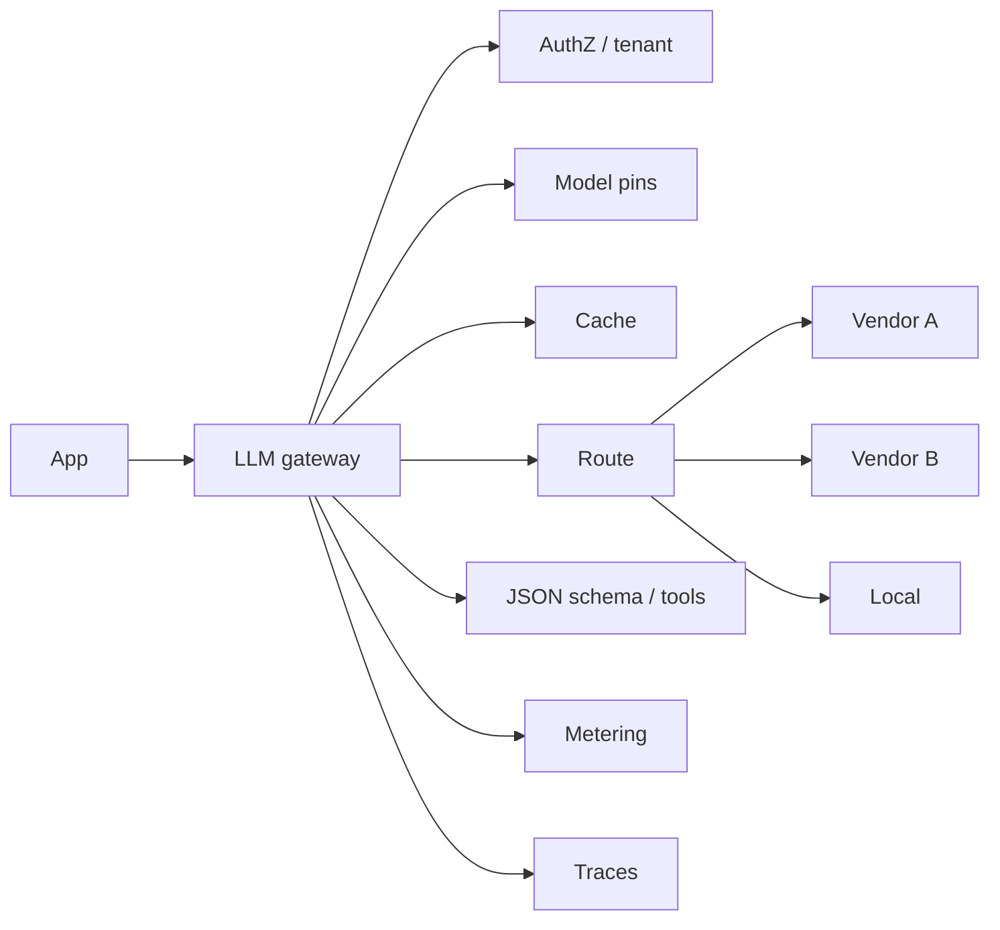

# Gateways, caching, structured output

**Default:** Put a **gateway** in front of every model. Application
teams should not hold vendor keys, pick models ad hoc, or parse English
when they needed JSON. The gateway is the platform: auth, pin, route,
cache, schema, budget, trace.

## Gateway

A gateway that is only "OpenAI with extra headers" will be bypassed.
A gateway that is useful:

- Issues **virtual keys** per team with budgets
- Pins `model_id` per environment (dev/canary/prod)
- Records every $ 
- Can fail over vendors for *some* tasks (not for tasks that forbid it)
- Offers **semantic and prefix cache**
- Validates structured output and tool calls
- Exposes a single internal API so apps do not rewrite on vendor churn

See the interview: [Design an LLM gateway](../interviews/06-llm-gateway.md).

## Caching, more carefully

**Exact cache.** Key: hash(model pin, prompt, temperature, tools).
Great for temperature 0 extractors. Dangerous if the prompt contains
a timestamp you forgot to strip.

**Prefix cache.** Automatic on modern APIs if the token prefix is
byte-stable. Enemies of the prefix cache: random IDs at the *front* of
the prompt, per-request timestamps in the system message, shuffled tool
lists. Put volatile data at the **end**.

**Semantic cache.** Embed the user question (+ tenant + policy + index
generation). Serve a previous answer if similarity > threshold **and**
the groundedness verifier still passes on the current index. Always
include `index_id` in the key or you will serve pre-policy-change
refunds.

## Structured output

When the product is a program, English is a bug.

Pattern:

1. JSON Schema (or grammar) on the request
2. Native structured output / constrained decode when the vendor has it
3. Validate in the gateway
4. On failure: **one** repair pass with the validator error, then fail
5. Never `json.loads` in a retry loop without a budget

For agents, the *tool call* schema is the structured output that
matters. Free-form "I'll call the CRM now" in English should not
execute anything.

## Prompt registry

Gateway + git:

- Prompts are files with ids, owners, evals
- Prod pulls a **release**, not whoever last edited a string in the DB
- Every request logs `prompt_id@version`
- Feature flags: 5% of traffic on vNext, canary eval attached

This is how you stop "we changed the prompt in prod at 2am".

## What interviewers listen for

- Gateway as **platform**, not as proxy
- **Prefix-cache hygiene**
- Schema validation with a bounded repair
- Prompt **releases**
- Metering that finance can audit
